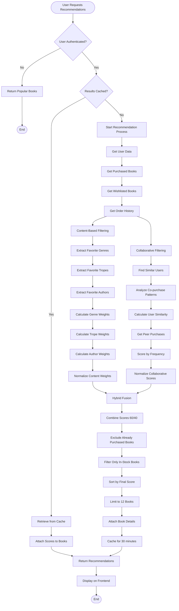
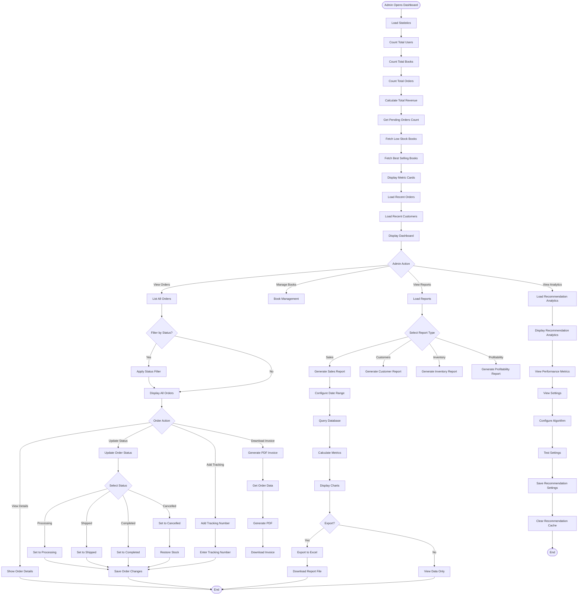
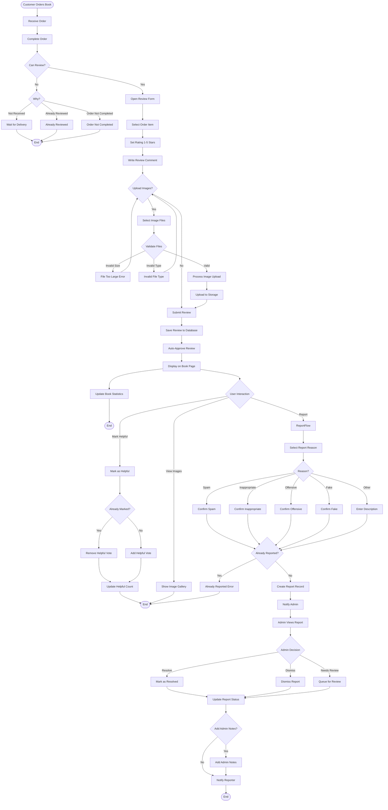
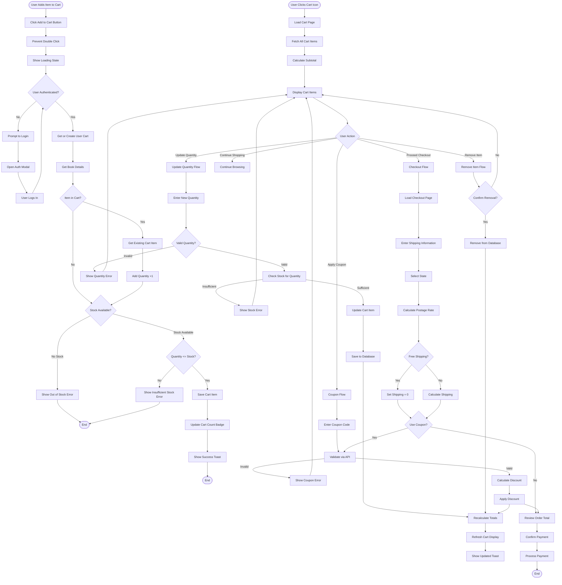
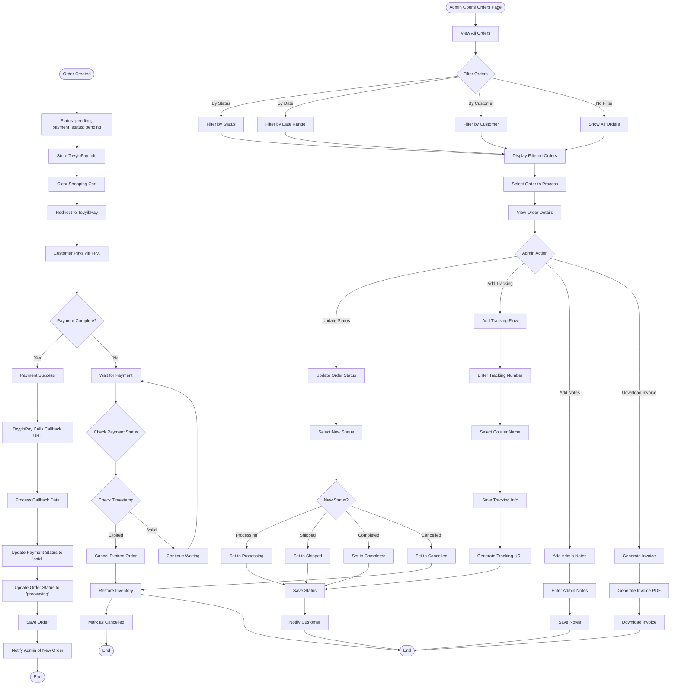
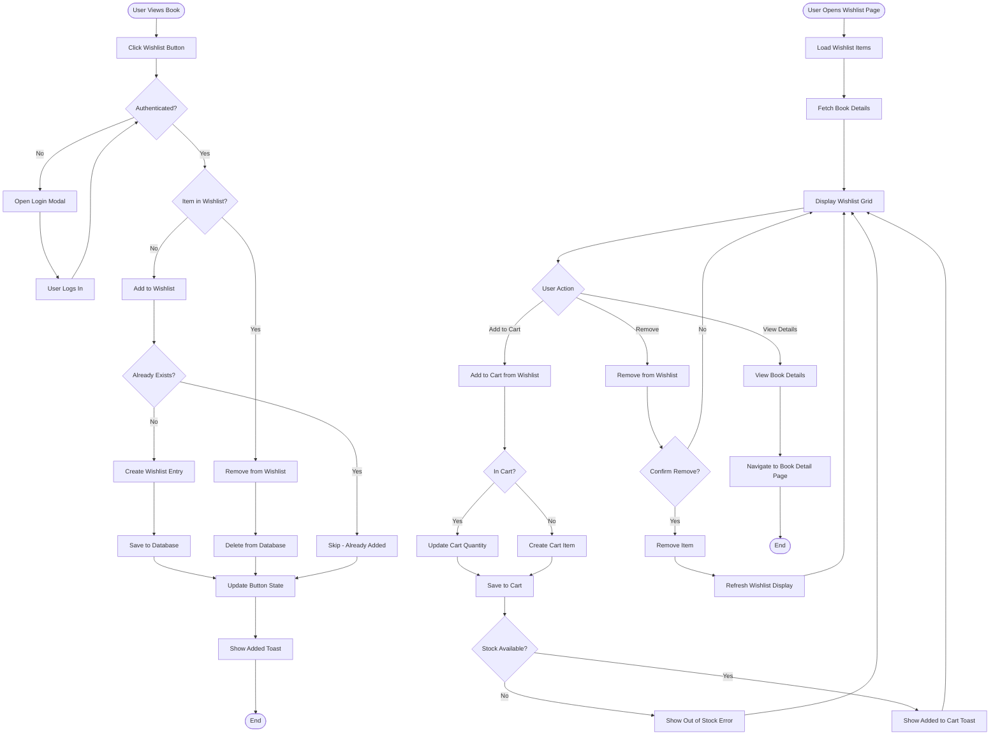
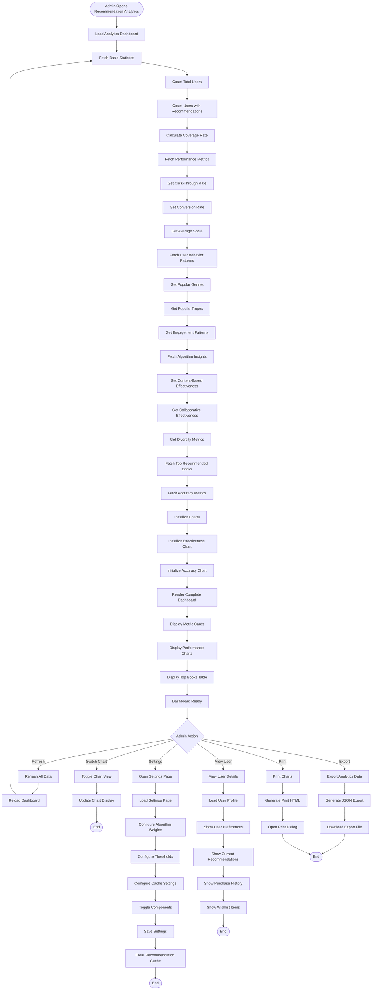
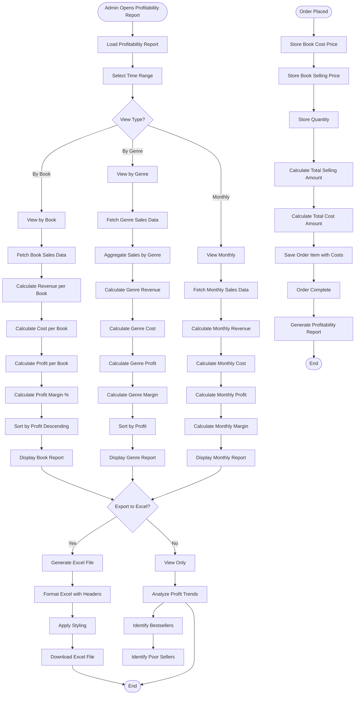

# Bookty E-Commerce System - Activity Diagrams

This document contains detailed activity diagrams for all major workflows in the Bookty system.

---

## 1. Customer Purchase Journey

### Complete Purchase Flow from Browse to Order Confirmation

```mermaid
graph TD
    Start([Customer Lands on Homepage]) --> CheckAuth{Authenticated?}
    CheckAuth -->|No| ShowGeneric[Show New Arrivals]
    CheckAuth -->|Yes| ShowPersonal[Show Personalized Recommendations]
    
    ShowGeneric --> Browse[Browse Books]
    ShowPersonal --> Browse
    
    Browse --> FilterOptions{Apply Filters?}
    FilterOptions -->|Yes| SelectGenre[Select Genre/Trope/Author]
    FilterOptions -->|No| ViewBooks[View Book List]
    SelectGenre --> ApplyFilter[Apply Filter]
    ApplyFilter --> ViewBooks
    
    ViewBooks --> ViewBook[Click on Book]
    ViewBook --> LoadDetails[Load Book Details]
    LoadDetails --> LoadSimilar[Load Similar Books Sidebar]
    LoadSimilar --> ShowDetails[Display Book Page]
    
    ShowDetails --> UserDecision{User Decision}
    UserDecision -->|Add to Cart| QuickAdd[Quick Add to Cart]
    UserDecision -->|Add Wishlist| AddWishlist[Add to Wishlist]
    UserDecision -->|View Reviews| ShowReviews[Show Reviews]
    UserDecision -->|Write Review| WriteReview[Write Review Form]
    
    QuickAdd --> CheckStock[Check Stock Availability]
    CheckStock -->|Insufficient| ErrorStock[Show Out of Stock Error]
    CheckStock -->|Available| UpdateCart[Update Cart Item]
    UpdateCart --> UpdateCount[Update Cart Badge Count]
    UpdateCount --> ShowToast[Show Success Toast]
    
    ErrorStock --> ShowDetails
    ShowToast --> Return[Return to Book]
    Return --> ShowDetails
    
    WriteReview --> CheckPurchased{Has Purchased?}
    CheckPurchased -->|No| ErrorReview[Cannot Review - Purchase Required]
    CheckPurchased -->|Yes| SubmitReview[Submit Review]
    CheckPurchased -->|Already Reviewed| ErrorDuplicate[Already Reviewed Error]
    ErrorDuplicate --> ShowDetails
    ErrorReview --> ShowDetails
    SubmitReview --> UploadImages[Upload Images]
    UploadImages --> SaveReview[Save Review]
    SaveReview --> ShowReviews
    
    ShowReviews --> AddToCart{Add to Cart?}
    AddWishlist --> ConfirmWishlist[Confirm Wishlist Addition]
    ConfirmWishlist --> ShowDetails
    
    AddToCart --> GoToCart[Go to Cart Page]
    GoToCart --> ViewCart[Display Cart Items]
    ViewCart --> CartDecision{Cart Decision}
    
    CartDecision -->|Update Quantity| UpdateQty[Update Item Quantity]
    CartDecision -->|Remove Item| RemoveItem[Remove from Cart]
    CartDecision -->|Apply Coupon| EnterCoupon[Enter Coupon Code]
    CartDecision -->|Proceed Checkout| CheckAuth2{Auth Check}
    
    UpdateQty --> ValidateStock[Validate Stock]
    ValidateStock --> SaveCart[Save Cart]
    SaveCart --> ViewCart
    
    RemoveItem --> SaveCart
    EnterCoupon --> ValidateCoupon[Validate Coupon]
    ValidateCoupon -->|Invalid| ErrorCoupon[Show Error]
    ValidateCoupon -->|Valid| ApplyCoupon[Apply Discount]
    ErrorCoupon --> ViewCart
    ApplyCoupon --> CalculateTotal[Recalculate Total]
    CalculateTotal --> ViewCart
    
    CheckAuth2 -->|Not Auth| RequireAuth[Require Authentication]
    RequireAuth --> ViewCart
    
    CheckAuth2 -->|Auth| ProceedCheckout[Load Checkout Page]
    ProceedCheckout --> EnterShipping[Enter Shipping Details]
    EnterShipping --> CalcPostage[Calculate Postage Rate]
    CalcPostage --> ApplyFreeShip{Has Free Shipping?}
    
    ApplyFreeShip -->|Flash Sale| SetFreeShip[Set Free Shipping]
    ApplyFreeShip -->|Coupon| SetFreeShip
    ApplyFreeShip -->|No Free Ship| CalculateShip[Calculate Shipping Cost]
    
    SetFreeShip --> ReviewOrder[Review Order Summary]
    CalculateShip --> ReviewOrder
    
    ReviewOrder --> ConfirmOrder[Confirm Order]
    ConfirmOrder --> StartTransaction[Start DB Transaction]
    
    StartTransaction --> LockStock[Lock Book Stock]
    LockStock --> CheckAllStock{All Items in Stock?}
    CheckAllStock -->|No| Rollback[Rollback Transaction]
    Rollback --> ReturnToCart[Return to Cart with Error]
    ReturnToCart --> ViewCart
    
    CheckAllStock -->|Yes| CreateOrder[Create Order Record]
    CreateOrder --> CreateOrderItems[Create Order Items]
    CreateOrderItems --> DecrementStock[Decrement Stock]
    DecrementStock --> CreatePayment[Create ToyyibPay Bill]
    
    CreatePayment --> PaymentCreated{Bill Created?}
    PaymentCreated -->|Failed| RollbackPayment[Rollback]
    PaymentCreated -->|Success| SavePayment[Save Payment Info]
    
    RollbackPayment --> ReturnToCart
    SavePayment --> CommitTransaction[Commit Transaction]
    CommitTransaction --> ClearCart[Clear Cart]
    ClearCart --> RedirectPayment[Redirect to ToyyibPay]
    
    RedirectPayment --> CustomerPay[Customer Completes FPX Payment]
    CustomerPay --> ToyyibPayCallback[ToyyibPay Callback]
    ToyyibPayCallback --> UpdateOrder[Update Order Status]
    UpdateOrder --> SendNotification[Send Notification]
    SendNotification --> RedirectReturn[ToyyibPay Return URL]
    RedirectReturn --> OrderSuccess[Display Order Success Page]
    OrderSuccess --> End([Order Complete])
```

---

## 2. Hybrid Recommendation System Flow

### Detailed Algorithm Execution

---

## 3. Admin Dashboard Analytics Flow

### Real-time Analytics & Reporting

---

## 4. Flash Sale Management Flow

### Creating & Managing Flash Sales

```mermaid
graph TD
    Start([Admin Opens Flash Sales]) --> ListSales[List Existing Sales]
    ListSales --> SelectAction{Select Action}
    
    SelectAction -->|Create New| StartCreate[Start Creation Process]
    SelectAction -->|Edit Existing| LoadSale[Load Sale Data]
    SelectAction -->|Toggle Active| ToggleSale[Toggle Sale Status]
    SelectAction -->|Delete| ConfirmDelete[Confirm Deletion]
    
    StartCreate --> EnterName[Enter Sale Name]
    EnterName --> EnterDescription[Enter Description]
    EnterDescription --> SetStartDate[Set Start Date & Time]
    SetStartDate --> SetEndDate[Set End Date & Time]
    SetEndDate --> ValidateDates{Validate Date Range}
    
    ValidateDates -->|Invalid| ErrorDates[Show Date Error]
    ValidateDates -->|Valid| SelectDiscount[Select Discount Type]
    ErrorDates --> SetEndDate
    
    SelectDiscount --> DiscountType{Discount Type?}
    DiscountType -->|Percentage| SetPercentDiscount[Set Percentage Value]
    DiscountType -->|Fixed| SetFixedDiscount[Set Fixed Amount]
    
    SetPercentDiscount --> ValidatePercent{1-100%?}
    ValidatePercent -->|No| ErrorPercent[Invalid Percentage]
    ValidatePercent -->|Yes| SelectBooks
    ErrorPercent --> SetPercentDiscount
    
    SetFixedDiscount --> SelectBooks[Select Books for Sale]
    SelectBooks --> LoadBooks[Load Available Books]
    LoadBooks --> FilterGenre{Filter by Genre?}
    FilterGenre -->|Yes| SelectGenre[Select Genre]
    FilterGenre -->|No| ShowAll[Show All Books]
    SelectGenre --> ShowByGenre[Show Books in Genre]
    ShowByGenre --> ChooseBooks[Choose Books]
    ShowAll --> ChooseBooks
    
    ChooseBooks --> SetSpecialPrice{Set Special Prices?}
    SetSpecialPrice -->|Yes| CheckSpecialPrice[For Each Book Check Special Price]
    SetSpecialPrice -->|No| CheckDiscountRules[Check Discount Rules]
    
    CheckSpecialPrice --> ValidateSpecial{Special Price < Original?}
    ValidateSpecial -->|No| ErrorSpecialPrice[Invalid Price]
    ValidateSpecial -->|Yes| ApplySpecial[Apply Special Price]
    ErrorSpecialPrice --> CheckSpecialPrice
    ApplySpecial --> CheckDiscountRules
    
    CheckDiscountRules --> ValidateDiscount{Validate Discount}
    ValidateDiscount -->|Invalid| ErrorDiscount[Show Error]
    ValidateDiscount -->|Valid| SetFreeShipping[Set Free Shipping Option]
    ErrorDiscount --> SetSpecialPrice
    
    SetFreeShipping --> CheckPriceRules[Re-check Price Rules]
    CheckPriceRules --> StartDB[Start DB Transaction]
    StartDB --> DeactivateOldSales[Deactivate Old Sales for Selected Books]
    DeactivateOldSales --> CreateFlashSale[Create Flash Sale Record]
    CreateFlashSale --> CreateItems[Create Flash Sale Items]
    CreateItems --> CommitDB[Commit Transaction]
    CommitDB --> Success[Flash Sale Created Successfully]
    Success --> RefreshList[Refresh Sales List]
    
    ToggleSale --> LoadSale
    LoadSale --> ShowEdit[Show Edit Form]
    ShowEdit --> UpdateSale[Update Sale Details]
    UpdateSale --> SaveChanges[Save Changes]
    SaveChanges --> RefreshList
    
    ConfirmDelete --> DeleteSale[Delete Sale]
    DeleteSale --> DeleteItems[Delete Items]
    DeleteItems --> RefreshList
    RefreshList --> End([End])
```

---

## 5. Review Moderation Flow

### Complete Review Lifecycle

---

## 6. Cart & Checkout Flow

### Detailed Shopping Cart Operations

---

## 7. Order Processing & Fulfillment Flow

### Complete Order Lifecycle

---

## 8. Wishlist Management Flow

### Adding & Managing Wishlist Items

---

## 9. Recommendation Analytics Dashboard Flow

### Admin Monitoring Recommendation Performance

---

## 10. Profitability Tracking Flow

### Cost Analysis & Profit Calculation

---

## Summary

These activity diagrams provide comprehensive visualization of all major workflows in the Bookty E-commerce system, covering:

1. ✅ **Customer Purchase Journey** - Complete flow from browsing to order completion
2. ✅ **Hybrid Recommendation System** - Algorithm execution and scoring
3. ✅ **Admin Dashboard & Analytics** - Real-time monitoring and reporting
4. ✅ **Flash Sale Management** - Creation and management of promotional sales
5. ✅ **Review Moderation** - Customer review lifecycle with moderation
6. ✅ **Cart & Checkout** - Shopping cart operations and checkout process
7. ✅ **Order Processing** - Order fulfillment and status management
8. ✅ **Wishlist Management** - Wishlist operations
9. ✅ **Recommendation Analytics** - Monitoring recommendation performance
10. ✅ **Profitability Tracking** - Cost analysis and profit calculation

Each diagram shows the complete flow including:
- Decision points
- Error handling
- Database operations
- User interactions
- System integrations
- Notification triggers

