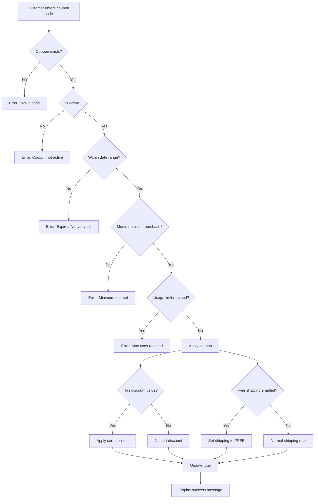

# 🎫 Bookty Coupon System - Complete Guide

**Last Updated**: January 2026  
**Version**: 2.0  
**Status**: ✅ Fully Functional

---

## 📋 Table of Contents

1. [Coupon Types & Combinations](#coupon-types--combinations)
2. [How It Works](#how-it-works)
3. [Creating Coupons](#creating-coupons)
4. [Testing Scenarios](#testing-scenarios)
5. [Edge Cases & Special Behaviors](#edge-cases--special-behaviors)
6. [Troubleshooting](#troubleshooting)
7. [Technical Implementation](#technical-implementation)

---

## 🎯 Coupon Types & Combinations

### Overview

Bookty supports **8 possible coupon combinations** based on 3 settings:
1. **Discount Type**: Fixed Amount or Percentage
2. **Discount Value**: Amount to discount (can be 0)
3. **Free Shipping**: Enable or Disable

---

### 1️⃣ **Fixed Discount Only** (No Free Shipping)

**Settings**:
- Discount Type: `Fixed Amount (RM)`
- Discount Value: `10.00` (or any amount)
- Free Shipping: `❌ OFF`

**Example**:
- Code: `SAVE10`
- Customer pays: Subtotal - RM 10.00 + Shipping

**Result**:
```
Subtotal:     RM 45.00
Discount:    -RM 10.00
Shipping:    +RM 10.00 (normal rate)
─────────────────────
Total:        RM 45.00
```

**Use Case**: Simple discount without affecting shipping

---

### 2️⃣ **Fixed Discount + Free Shipping** ⭐

**Settings**:
- Discount Type: `Fixed Amount (RM)`
- Discount Value: `10.00`
- Free Shipping: `✅ ON`

**Example**:
- Code: `SAVE10FREE`
- Customer gets: RM 10 discount + free shipping

**Result**:
```
Subtotal:     RM 45.00
Discount:    -RM 10.00
Shipping:     FREE (was RM 10.00)
─────────────────────
Total:        RM 35.00
```

**Use Case**: Maximum savings for customers, great for promotions

---

### 3️⃣ **Free Shipping Only** (No Discount)

**Settings**:
- Discount Type: `Fixed Amount (RM)`
- Discount Value: `0.00` (zero)
- Free Shipping: `✅ ON`

**Example**:
- Code: `FREESHIP`
- Customer gets: Only free shipping, no cart discount

**Result**:
```
Subtotal:     RM 45.00
Discount:     (none)
Shipping:     FREE (was RM 10.00)
─────────────────────
Total:        RM 45.00
```

**Use Case**: Encourage purchases by removing shipping cost

---

### 4️⃣ **Percentage Discount Only** (No Free Shipping)

**Settings**:
- Discount Type: `Percentage (%)`
- Discount Value: `15` (15%)
- Free Shipping: `❌ OFF`

**Example**:
- Code: `SALE15`
- Customer gets: 15% off subtotal

**Result**:
```
Subtotal:     RM 100.00
Discount:     -RM 15.00 (15%)
Shipping:     +RM 10.00
─────────────────────
Total:        RM 95.00
```

**Use Case**: Flash sales, seasonal promotions

---

### 5️⃣ **Percentage Discount + Free Shipping** 🔥

**Settings**:
- Discount Type: `Percentage (%)`
- Discount Value: `20` (20%)
- Free Shipping: `✅ ON`

**Example**:
- Code: `MEGA20`
- Customer gets: 20% off + free shipping

**Result**:
```
Subtotal:     RM 100.00
Discount:     -RM 20.00 (20%)
Shipping:     FREE (was RM 10.00)
─────────────────────
Total:        RM 80.00
```

**Use Case**: Major promotional events (11.11, Black Friday)

---

### 6️⃣ **No Discount, No Free Shipping** (Invalid ❌)

**Settings**:
- Discount Value: `0.00`
- Free Shipping: `❌ OFF`

**Result**: ⚠️ **Not Recommended** - Coupon does nothing!

**Why Invalid**: Customers will be confused applying a coupon that gives no benefit.

**System Behavior**: Coupon validates successfully but applies no changes.

---

### 7️⃣ **Fixed Discount with Minimum Purchase**

**Settings**:
- Discount Type: `Fixed Amount (RM)`
- Discount Value: `30.00`
- Minimum Purchase: `100.00`
- Free Shipping: `❌ OFF`

**Example**:
- Code: `BIG30`
- Customer must spend ≥ RM 100 to use

**Validation**:
```
Subtotal RM 80:  ❌ "Requires minimum purchase of RM 100"
Subtotal RM 120: ✅ Applies -RM 30 discount
```

**Use Case**: Encourage larger orders

---

### 8️⃣ **Free Shipping with Minimum Purchase** 📦

**Settings**:
- Discount Value: `0.00`
- Minimum Purchase: `50.00`
- Free Shipping: `✅ ON`

**Example**:
- Code: `SHIP50`
- Customer gets free shipping if spending ≥ RM 50

**Validation**:
```
Subtotal RM 40:  ❌ "Requires minimum purchase of RM 50"
Subtotal RM 60:  ✅ Free shipping applied
```

**Use Case**: Common in e-commerce to increase average order value

---

## 🔧 How It Works

### Application Flow



---

## 📝 Creating Coupons

### Step-by-Step Guide

#### 1. **Navigate to Coupons**
- Admin Dashboard → Promotions → Coupon Codes

#### 2. **Click "Create New Coupon"**

#### 3. **Fill in Basic Information**

**Coupon Code** (Required)
- Example: `SAVE10`, `FREESHIP`, `WELCOME20`
- Auto-uppercase (saves as `SAVE10` even if you type `save10`)
- Must be unique
- Max 50 characters
- Tip: Use "Generate Code" button for random codes

**Description** (Optional)
- Example: "Summer Sale - RM 10 off"
- Helps you remember what the coupon is for
- Shows to customers in API response

---

#### 4. **Choose Discount Type**

**Option A: Fixed Amount (RM)**
- Exact amount off the subtotal
- Example: RM 10.00 = exactly RM 10 discount
- Best for: Simple promotions

**Option B: Percentage (%)**
- Percentage off the subtotal
- Example: 15 = 15% discount
- Best for: Scaling discounts (higher cart = more savings)

---

#### 5. **Set Discount Value**

**For Cart Discount**:
- Enter the amount or percentage
- Example: `10.00` or `15`

**For Free Shipping Only**:
- Enter `0` (zero)
- System will only apply free shipping

⚠️ **Important**: Even if "Offer Free Shipping" is ON, you still need to enter a discount value (can be 0).

---

#### 6. **Configure Minimum Purchase** (Optional)

**Leave empty or 0**: No minimum requirement

**Enter amount**: Example `50.00`
- Coupon only works if cart subtotal ≥ RM 50.00
- Error message shows if not met

**Use Cases**:
```
No minimum (0):      Anyone can use
Minimum RM 30:       Small order threshold
Minimum RM 100:      Encourage bigger purchases
Minimum RM 500:      VIP/Wholesale discounts
```

---

#### 7. **Set Usage Limits** (Optional)

**Maximum Total Uses**
- Leave empty: Unlimited uses by everyone
- Example: `100` = only 100 customers can use this code total

**Maximum Uses Per User**
- Leave empty: User can use unlimited times
- Example: `1` = each user can only use once
- Example: `3` = each user can use 3 times

**Combinations**:
```
Total: 100, Per User: 1    → 100 different customers, once each
Total: 50,  Per User: 2    → Up to 50 uses total, max 2 per customer
Total: ∞,   Per User: 1    → Everyone once (new customer promo)
Total: 1,   Per User: 1    → First customer only (race!)
```

---

#### 8. **Set Date Range**

**Start Date**
- When coupon becomes active
- Example: `01/04/2026 00:00` = starts April 1st midnight

**Expiry Date**
- When coupon stops working
- Must be after start date
- Example: `02/04/2026 23:59` = expires end of Feb 4th

**Validation**: System checks current time against this range

---

#### 9. **Toggle "Offer Free Shipping"**

**OFF (Gray)** ❌
- Customer pays normal shipping rates
- Shipping calculated by region (SM/Sabah/Sarawak/Labuan)

**ON (Green)** ✅
- Customer gets free shipping (RM 0.00)
- Works for all regions
- Overrides any flash sale/discount free shipping

---

#### 10. **Save Coupon**

- Click "Create Coupon" button
- System validates all fields
- Redirects to coupon list
- Status: Active by default

---

## 🧪 Testing Scenarios

### Test Case 1: Fixed Discount Only

**Setup**:
```
Code: TEST10
Discount: Fixed RM 10.00
Free Shipping: OFF
Min Purchase: None
```

**Test**:
1. Add RM 50 book to cart
2. Go to checkout (Selangor) - shipping RM 10
3. Apply code `TEST10`
4. Expected: Subtotal RM 50 - RM 10 discount + RM 10 shipping = **RM 50 total**

---

### Test Case 2: Free Shipping Only

**Setup**:
```
Code: SHIPFREE
Discount: Fixed RM 0.00
Free Shipping: ON
Min Purchase: RM 30.00
```

**Test A** (Below Minimum):
1. Add RM 25 book
2. Apply `SHIPFREE`
3. Expected: ❌ Error "Requires minimum purchase of RM 30.00"

**Test B** (Meets Minimum):
1. Add RM 40 book
2. Go to checkout (Sabah) - shipping RM 15
3. Apply `SHIPFREE`
4. Expected: Subtotal RM 40 + FREE shipping = **RM 40 total**

---

### Test Case 3: Percentage + Free Shipping

**Setup**:
```
Code: MEGA20
Discount: Percentage 20%
Free Shipping: ON
Min Purchase: None
```

**Test**:
1. Add RM 100 worth of books
2. Go to checkout (Sarawak) - shipping RM 15
3. Apply `MEGA20`
4. Expected: 
   - Subtotal: RM 100
   - Discount: -RM 20 (20%)
   - Shipping: FREE
   - Total: **RM 80**

---

### Test Case 4: Usage Limits

**Setup**:
```
Code: FIRSTBUY
Discount: Fixed RM 50.00
Free Shipping: ON
Max Uses Total: 10
Max Uses Per User: 1
```

**Test A** (First Use):
1. User A applies `FIRSTBUY`
2. Expected: ✅ Works (usage count: 1/10)

**Test B** (Second Use by Same User):
1. User A tries `FIRSTBUY` again
2. Expected: ❌ Error "You have already used this coupon"

**Test C** (10th Use):
1. User J applies `FIRSTBUY` (10th person)
2. Expected: ✅ Works (usage count: 10/10)

**Test D** (11th Use):
1. User K tries `FIRSTBUY`
2. Expected: ❌ Error "Maximum usage limit reached"

---

### Test Case 5: Date Range

**Setup**:
```
Code: XMAS2026
Discount: Percentage 30%
Free Shipping: ON
Start: 20/12/2026 00:00
Expiry: 26/12/2026 23:59
```

**Test A** (Before Start):
- Current: 19/12/2026
- Expected: ❌ Error "Coupon is not yet valid"

**Test B** (During Period):
- Current: 24/12/2026
- Expected: ✅ Works

**Test C** (After Expiry):
- Current: 27/12/2026
- Expected: ❌ Error "Coupon has expired"

---

## ⚠️ Edge Cases & Special Behaviors

### Edge Case 1: Discount Exceeds Subtotal

**Scenario**:
- Coupon: Fixed RM 50 discount
- Cart subtotal: RM 30
- Shipping: RM 10

**Behavior**:
```php
$discountAmount = min($coupon->discount_value, $orderAmount);
// Result: min(50, 30) = RM 30
```

**Result**: Discount capped at RM 30 (subtotal amount)
- Cannot have negative subtotal
- Total = RM 0 (subtotal) + RM 10 (shipping) = **RM 10**

---

### Edge Case 2: Multiple Free Shipping Sources

**Scenario**:
- Book has flash sale with free shipping
- Customer also applies coupon with free shipping

**Behavior**:
```php
// CheckoutController checks in order:
1. Check if any cart item has flash sale free shipping
2. Check if any cart item has discount free shipping  
3. Check if coupon has free shipping
4. If ANY is true → free shipping = true
```

**Result**: Free shipping from ANY source applies (doesn't stack)

---

### Edge Case 3: NULL vs 0 Minimum Purchase

**NULL** (Empty field):
```
min_purchase_amount = NULL
→ No minimum required
→ Validation: SKIP minimum check
```

**0** (Zero):
```
min_purchase_amount = 0.00
→ No minimum required
→ Validation: 0 < 0.00 ? No → PASS
```

**Both work the same**: No minimum required ✅

---

### Edge Case 4: Inactive Coupon

**Scenario**:
- Coupon exists in database
- Admin toggles "Active" to OFF

**Behavior**:
- Frontend: Coupon appears in list (grayed out)
- API: Validation fails
- Error: "This coupon is not active"

**Admin can deactivate** without deleting for:
- Temporary pause
- Historical records
- Prevent deletion of used coupons

---

### Edge Case 5: Concurrent Usage Race Condition

**Scenario**:
- Coupon: Max 1 use total
- Two users apply simultaneously

**Behavior**:
```php
// Controller checks: usages()->count() >= max_uses_total
// First user: 0 >= 1 ? No → Allow
// Second user: 1 >= 1 ? Yes → Block
```

**Result**: First transaction wins, second gets error

**Note**: No explicit locking, relies on database transaction isolation

---

## 🔧 Troubleshooting

### Problem 1: "An error occurred. Please try again."

**Causes**:
1. ✅ **FIXED**: JavaScript `subtotal` variable undefined
2. Server error (check logs)
3. CSRF token expired

**Solution**:
- Refresh page (Ctrl+F5)
- Check browser console for errors
- Check Laravel logs: `storage/logs/laravel.log`

---

### Problem 2: Coupon Shows Success But Doesn't Apply

**Causes**:
1. ✅ **FIXED**: Toggle `free_shipping` using `has()` instead of `boolean()`
2. JavaScript not updating UI
3. Cache issue

**Solution**:
- Clear browser cache
- Check if shipping amount updates after applying
- Verify in database that `free_shipping` column changed

---

### Problem 3: "Invalid coupon code"

**Causes**:
- Code doesn't exist
- Typo in code
- Case sensitivity (shouldn't matter - system auto-uppercases)

**Solution**:
- Check database `coupons` table
- Verify exact code spelling
- Check if coupon was deleted

---

### Problem 4: "This coupon requires minimum purchase of RM X"

**Causes**:
- Cart subtotal below minimum
- Shipping included in calculation (shouldn't be)

**Solution**:
- Add more items to cart
- Check subtotal amount (before shipping)
- Verify `min_purchase_amount` in database

---

### Problem 5: "You have already used this coupon"

**Causes**:
- User reached `max_uses_per_user` limit
- Check `coupon_usages` table

**Solution**:
- Contact admin to check usage count
- Admin can increase limit or create new coupon
- User can use different account (if not against policy)

---

### Problem 6: Toggle Doesn't Update Database

**Status**: ✅ **FIXED**

**Previous Bug**:
```php
// WRONG
$request->has('free_shipping')  // Always true (hidden input exists)
```

**Current Fix**:
```php
// CORRECT
$request->boolean('free_shipping')  // Returns true/false based on value
```

---

## 🔬 Technical Implementation

### Database Schema

**Table**: `coupons`

```sql
CREATE TABLE coupons (
    id BIGINT UNSIGNED PRIMARY KEY AUTO_INCREMENT,
    code VARCHAR(50) UNIQUE NOT NULL,
    description VARCHAR(255) NULL,
    discount_type ENUM('fixed', 'percentage') NOT NULL,
    discount_value DECIMAL(10,2) NOT NULL,
    min_purchase_amount DECIMAL(10,2) NULL,
    max_uses_per_user INT NULL,
    max_uses_total INT NULL,
    starts_at DATETIME NOT NULL,
    expires_at DATETIME NOT NULL,
    is_active BOOLEAN DEFAULT 1,
    free_shipping BOOLEAN DEFAULT 0,  -- KEY FIELD
    created_at TIMESTAMP,
    updated_at TIMESTAMP
);
```

---

### Model: `Coupon.php`

**Key Methods**:

```php
public function isValidFor($user, $orderAmount)
{
    // ✅ FIXED: NULL comparison
    if ($this->min_purchase_amount !== null 
        && $orderAmount < $this->min_purchase_amount) {
        return false;
    }
    // ... other validations
}

public function calculateDiscount($orderAmount)
{
    // Free shipping only (no cart discount)
    if ($this->free_shipping && !$this->discount_value) {
        return 0;
    }
    
    // Fixed discount
    if ($this->discount_type === 'fixed') {
        return min($this->discount_value ?? 0, $orderAmount);
    }
    
    // Percentage discount
    if ($this->discount_type === 'percentage') {
        return ($orderAmount * ($this->discount_value ?? 0)) / 100;
    }
    
    return 0;
}
```

---

### Controller: `CouponController.php`

**Key Fix**:

```php
// BEFORE (WRONG) ❌
$coupon->free_shipping = $request->has('free_shipping') ? true : false;
// Problem: Always true because hidden input exists

// AFTER (CORRECT) ✅
$coupon->free_shipping = $request->boolean('free_shipping');
// Returns: true if value="1", false if value="0"
```

---

### API Response Format

**Success**:
```json
{
  "valid": true,
  "message": "Coupon applied! Free shipping activated.",
  "discount_amount": 10.00,
  "free_shipping": true,
  "coupon": {
    "code": "SAVE10FREE",
    "id": 1,
    "description": "Save RM10 + Free Shipping"
  }
}
```

**Error**:
```json
{
  "valid": false,
  "message": "This coupon requires a minimum purchase of RM 50.00"
}
```

---

### Frontend Integration

**File**: `resources/views/checkout/index.blade.php`

**Key Logic**:

```javascript
// ✅ FIXED: Define subtotal in correct scope
const subtotal = parseAmount(subtotalElement.innerText);

// Validate coupon via API
fetch('/api/coupons/validate', {
    method: 'POST',
    body: JSON.stringify({
        code: couponCode,
        amount: subtotal  // Subtotal only (no shipping)
    })
})
.then(data => {
    if (data.valid) {
        // Show discount if any
        if (data.discount_amount > 0) {
            discountRow.classList.remove('hidden');
            discountAmount.innerText = `-RM ${data.discount_amount.toFixed(2)}`;
        }
        
        // Re-fetch shipping (will be free if coupon has free_shipping)
        fetchPostage(selectedState);
    }
})
```

---

## 📊 Coupon Combinations Matrix

| # | Discount Type | Discount Value | Free Shipping | Use Case | Example Code |
|---|---------------|----------------|---------------|----------|--------------|
| 1 | Fixed | > 0 | ❌ OFF | Simple discount | `SAVE10` |
| 2 | Fixed | > 0 | ✅ ON | Best value | `SAVE10FREE` |
| 3 | Fixed | 0 | ✅ ON | Free ship only | `FREESHIP` |
| 4 | Percentage | > 0 | ❌ OFF | Flash sale | `SALE15` |
| 5 | Percentage | > 0 | ✅ ON | Major event | `MEGA20` |
| 6 | Fixed | 0 | ❌ OFF | ⚠️ Invalid | (none) |
| 7 | Fixed | > 0 + Min | ❌ OFF | Bulk order | `BIG30` |
| 8 | Fixed | 0 + Min | ✅ ON | Min for free ship | `SHIP50` |

**Total Valid Combinations**: 7 (excludes #6)

---

## 🎉 Summary

### Supported Features

✅ Fixed amount discounts (RM)  
✅ Percentage discounts (%)  
✅ Free shipping toggle  
✅ Minimum purchase requirements  
✅ Total usage limits  
✅ Per-user usage limits  
✅ Date range validation  
✅ Active/inactive toggle  
✅ Unique code validation  
✅ NULL vs 0 minimum handling  
✅ Discount cap at subtotal  
✅ Multiple free shipping sources  
✅ Real-time validation  
✅ Usage tracking

### Recent Fixes

✅ NULL comparison bug (Model + Controller)  
✅ Undefined JavaScript variable  
✅ Toggle `has()` vs `boolean()` bug  
✅ Free shipping UI display  
✅ Enhanced API response  

### Current Status

**Version**: 2.0  
**Stability**: High  
**Known Issues**: None  
**Last Tested**: January 2026  

---

## 📞 Support

For issues or questions:
1. Check [BUGFIX_COUPON_VALIDATION.md](./BUGFIX_COUPON_VALIDATION.md)
2. Review Laravel logs: `storage/logs/laragon.log`
3. Check browser console for JavaScript errors
4. Test in incognito mode (rules out cache issues)

---

**End of Guide** 🎫✨
