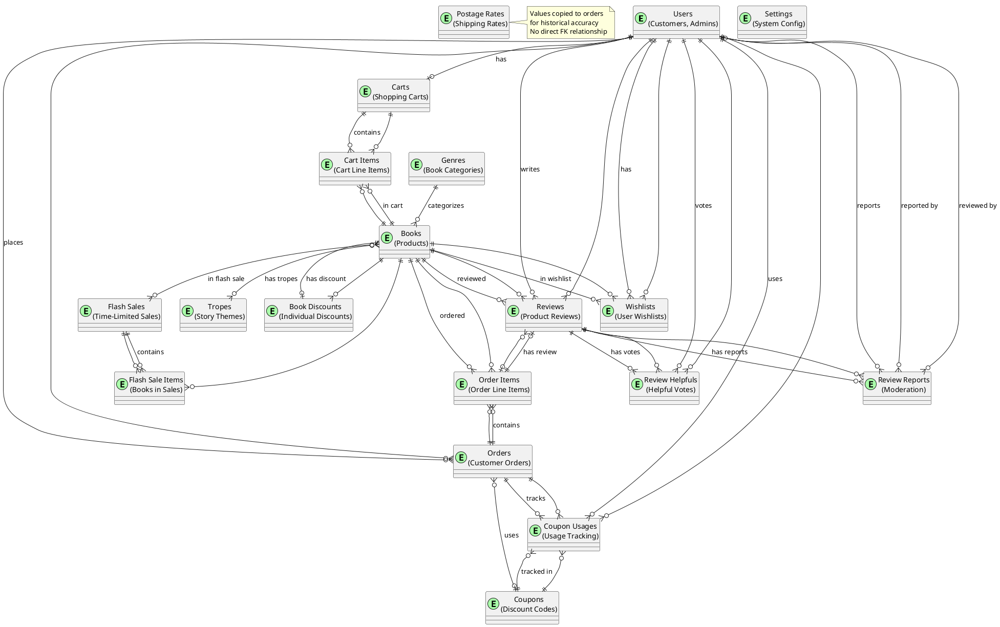

# Bookty E-Commerce - Complete Database ERD (Entity Relationship Diagram)

## 📊 Overview

This document provides a comprehensive Entity Relationship Diagram (ERD) for the Bookty E-Commerce platform, showing all database tables, their attributes, and relationships.

---

## 🗂️ Database Entities Summary

**Total Entities: 19**

### Core Entities
1. **users** - User accounts (customers, admins)
2. **genres** - Book genres/categories
3. **tropes** - Story tropes/themes
4. **books** - Product catalog
5. **carts** - Shopping carts
6. **cart_items** - Items in shopping carts
7. **orders** - Customer orders
8. **order_items** - Order line items
9. **wishlists** - User wishlists

### Promotion Entities
10. **coupons** - Discount coupons
11. **coupon_usages** - Coupon usage tracking
12. **book_discounts** - Individual book discounts
13. **flash_sales** - Time-limited sales
14. **flash_sale_items** - Books in flash sales

### Review & Feedback Entities
15. **reviews** - Product reviews
16. **review_helpfuls** - Helpful votes on reviews
17. **review_reports** - Inappropriate content reports

### System Entities
18. **postage_rates** - Shipping rates by region
19. **settings** - System configuration

### Pivot Tables
- **book_trope** - Many-to-many: Books ↔ Tropes
- **model_has_roles** - Many-to-many: Users ↔ Roles (Spatie Permissions)
- **model_has_permissions** - Many-to-many: Users ↔ Permissions (Spatie Permissions)
- **role_has_permissions** - Many-to-many: Roles ↔ Permissions (Spatie Permissions)

---

## 📐 Complete ERD Diagram

### Mermaid Format (for GitHub/VS Code)

```mermaid
erDiagram
    %% Core User & Authentication
    users ||--o{ orders : "places"
    users ||--o| carts : "has"
    users ||--o{ reviews : "writes"
    users ||--o{ wishlists : "has"
    users ||--o{ review_helpfuls : "votes"
    users ||--o{ review_reports : "reports"
    users ||--o{ coupon_usages : "uses"
    users }o--o{ roles : "has (Spatie)"
    users }o--o{ permissions : "has (Spatie)"

    %% Product Catalog
    genres ||--o{ books : "categorizes"
    books }o--o{ tropes : "has (book_trope)"
    books ||--o{ cart_items : "in cart"
    books ||--o{ order_items : "ordered"
    books ||--o{ reviews : "reviewed"
    books ||--o{ wishlists : "in wishlist"
    books ||--o| book_discounts : "has discount"
    books }o--o{ flash_sales : "in sale (flash_sale_items)"

    %% Shopping Cart
    carts ||--o{ cart_items : "contains"
    cart_items }o--|| books : "references"
    cart_items }o--|| carts : "belongs to"

    %% Orders
    orders ||--o{ order_items : "contains"
    orders }o--|| users : "belongs to"
    orders }o--o| coupons : "uses"
    orders ||--o{ coupon_usages : "tracks"
    order_items }o--|| orders : "belongs to"
    order_items }o--|| books : "references"
    order_items ||--o| reviews : "has review"

    %% Wishlist
    wishlists }o--|| users : "belongs to"
    wishlists }o--|| books : "references"

    %% Promotions
    coupons ||--o{ coupon_usages : "tracked in"
    coupon_usages }o--|| coupons : "references"
    coupon_usages }o--|| users : "used by"
    coupon_usages }o--|| orders : "applied to"
    
    book_discounts }o--|| books : "applies to"
    
    flash_sales ||--o{ flash_sale_items : "contains"
    flash_sale_items }o--|| flash_sales : "belongs to"
    flash_sale_items }o--|| books : "references"

    %% Reviews
    reviews }o--|| users : "written by"
    reviews }o--|| books : "for"
    reviews }o--|| order_items : "from"
    reviews ||--o{ review_helpfuls : "has votes"
    reviews ||--o{ review_reports : "has reports"
    review_helpfuls }o--|| reviews : "for"
    review_helpfuls }o--|| users : "voted by"
    review_reports }o--|| reviews : "reports"
    review_reports }o--|| users : "reported by"
    review_reports }o--o| users : "reviewed by admin"

    %% System
    postage_rates ||--o{ orders : "used in (denormalized)"
    settings ||--o{ } : "system config"
```

---

## 📋 Detailed Entity Descriptions

### 1. **users** (User Accounts)

**Primary Key:** `id`

**Attributes:**
- `id` (bigint, auto-increment)
- `name` (string)
- `email` (string, unique)
- `email_verified_at` (timestamp, nullable)
- `password` (string, hashed)
- `phone_number` (string, nullable)
- `age` (integer, nullable)
- `address_line1` (string, nullable)
- `address_line2` (string, nullable)
- `city` (string, nullable)
- `state` (string, nullable)
- `postal_code` (string, nullable)
- `country` (string, nullable)
- `remember_token` (string, nullable)
- `created_at` (timestamp)
- `updated_at` (timestamp)

**Relationships:**
- `hasMany` → `orders`
- `hasOne` → `carts`
- `hasMany` → `reviews`
- `hasMany` → `wishlists`
- `hasMany` → `review_helpfuls`
- `hasMany` → `review_reports` (as reporter)
- `belongsToMany` → `books` (via `wishlists`)
- `hasMany` → `coupon_usages`
- `belongsToMany` → `roles` (Spatie Permissions)
- `belongsToMany` → `permissions` (Spatie Permissions)

---

### 2. **genres** (Book Genres)

**Primary Key:** `id`

**Attributes:**
- `id` (bigint, auto-increment)
- `name` (string)
- `slug` (string, unique)
- `description` (text, nullable)
- `created_at` (timestamp)
- `updated_at` (timestamp)

**Relationships:**
- `hasMany` → `books`

---

### 3. **tropes** (Story Tropes/Themes)

**Primary Key:** `id`

**Attributes:**
- `id` (bigint, auto-increment)
- `name` (string)
- `slug` (string, unique)
- `description` (text, nullable)
- `created_at` (timestamp)
- `updated_at` (timestamp)

**Relationships:**
- `belongsToMany` → `books` (via `book_trope` pivot table)

---

### 4. **books** (Product Catalog)

**Primary Key:** `id`

**Attributes:**
- `id` (bigint, auto-increment)
- `title` (string)
- `slug` (string, unique)
- `author` (string)
- `synopsis` (text, nullable)
- `price` (decimal 10,2)
- `cost_price` (decimal 10,2, nullable)
- `stock` (integer, default: 0)
- `cover_image` (string, nullable)
- `genre_id` (bigint, foreign key → `genres.id`)
- `created_at` (timestamp)
- `updated_at` (timestamp)

**Relationships:**
- `belongsTo` → `genres`
- `belongsToMany` → `tropes` (via `book_trope`)
- `hasMany` → `cart_items`
- `hasMany` → `order_items`
- `hasMany` → `reviews`
- `hasMany` → `wishlists`
- `hasOne` → `book_discounts` (active)
- `hasMany` → `flash_sale_items`
- `belongsToMany` → `flash_sales` (via `flash_sale_items`)

---

### 5. **book_trope** (Pivot Table: Books ↔ Tropes)

**Primary Key:** `id`

**Attributes:**
- `id` (bigint, auto-increment)
- `book_id` (bigint, foreign key → `books.id`, cascade delete)
- `trope_id` (bigint, foreign key → `tropes.id`, cascade delete)
- `created_at` (timestamp)
- `updated_at` (timestamp)

**Unique Constraint:** `(book_id, trope_id)`

---

### 6. **carts** (Shopping Carts)

**Primary Key:** `id`

**Attributes:**
- `id` (bigint, auto-increment)
- `user_id` (bigint, foreign key → `users.id`, unique)
- `created_at` (timestamp)
- `updated_at` (timestamp)

**Relationships:**
- `belongsTo` → `users`
- `hasMany` → `cart_items`

---

### 7. **cart_items** (Cart Line Items)

**Primary Key:** `id`

**Attributes:**
- `id` (bigint, auto-increment)
- `cart_id` (bigint, foreign key → `carts.id`, cascade delete)
- `book_id` (bigint, foreign key → `books.id`, cascade delete)
- `quantity` (integer)
- `created_at` (timestamp)
- `updated_at` (timestamp)

**Relationships:**
- `belongsTo` → `carts`
- `belongsTo` → `books`

---

### 8. **orders** (Customer Orders)

**Primary Key:** `id`

**Attributes:**
- `id` (bigint, auto-increment)
- `user_id` (bigint, foreign key → `users.id`)
- `public_id` (string, unique) - Public order identifier
- `total_amount` (decimal 10,2)
- `status` (enum: 'pending', 'processing', 'shipped', 'completed', 'cancelled')
- `payment_status` (enum: 'pending', 'paid', 'failed', 'refunded')
- `shipping_address` (string)
- `shipping_city` (string)
- `shipping_state` (string)
- `shipping_region` (enum: 'sm', 'sabah', 'sarawak', 'labuan', nullable)
- `shipping_customer_price` (decimal 10,2, default: 0) - Denormalized
- `shipping_actual_cost` (decimal 10,2, default: 0) - Denormalized
- `is_free_shipping` (boolean, default: false)
- `shipping_postal_code` (string)
- `shipping_phone` (string)
- `admin_notes` (text, nullable)
- `tracking_number` (string, nullable)
- `coupon_id` (bigint, foreign key → `coupons.id`, nullable)
- `discount_amount` (decimal 10,2, default: 0)
- `coupon_code` (string, nullable) - Denormalized
- `toyyibpay_bill_code` (string, nullable)
- `toyyibpay_payment_url` (string, nullable)
- `toyyibpay_invoice_no` (string, nullable)
- `toyyibpay_payment_date` (datetime, nullable)
- `toyyibpay_settlement_reference` (string, nullable)
- `toyyibpay_settlement_date` (datetime, nullable)
- `created_at` (timestamp)
- `updated_at` (timestamp)

**Relationships:**
- `belongsTo` → `users`
- `hasMany` → `order_items`
- `belongsTo` → `coupons` (optional)
- `hasMany` → `coupon_usages`

**Note:** `shipping_customer_price` and `shipping_actual_cost` are denormalized from `postage_rates` for historical accuracy.

---

### 9. **order_items** (Order Line Items)

**Primary Key:** `id`

**Attributes:**
- `id` (bigint, auto-increment)
- `order_id` (bigint, foreign key → `orders.id`, cascade delete)
- `book_id` (bigint, foreign key → `books.id`)
- `quantity` (integer)
- `price` (decimal 10,2) - Price at time of order (denormalized)
- `cost_price` (decimal 10,2, nullable) - Cost at time of order (denormalized)
- `total_selling` (decimal 10,2) - quantity × price
- `total_cost` (decimal 10,2, nullable) - quantity × cost_price
- `created_at` (timestamp)
- `updated_at` (timestamp)

**Relationships:**
- `belongsTo` → `orders`
- `belongsTo` → `books`
- `hasOne` → `reviews`

**Note:** `price` and `cost_price` are denormalized from `books` for historical accuracy.

---

### 10. **wishlists** (User Wishlists)

**Primary Key:** `id`

**Attributes:**
- `id` (bigint, auto-increment)
- `user_id` (bigint, foreign key → `users.id`, cascade delete)
- `book_id` (bigint, foreign key → `books.id`, cascade delete)
- `created_at` (timestamp)
- `updated_at` (timestamp)

**Unique Constraint:** `(user_id, book_id)`

**Relationships:**
- `belongsTo` → `users`
- `belongsTo` → `books`

---

### 11. **coupons** (Discount Coupons)

**Primary Key:** `id`

**Attributes:**
- `id` (bigint, auto-increment)
- `code` (string, unique)
- `description` (text, nullable)
- `discount_type` (enum: 'fixed', 'percentage')
- `discount_value` (decimal 10,2)
- `min_purchase_amount` (decimal 10,2, nullable)
- `max_uses_per_user` (integer, nullable)
- `max_uses_total` (integer, nullable)
- `starts_at` (datetime, nullable)
- `expires_at` (datetime, nullable)
- `is_active` (boolean, default: true)
- `free_shipping` (boolean, default: false)
- `created_at` (timestamp)
- `updated_at` (timestamp)

**Relationships:**
- `hasMany` → `coupon_usages`
- `hasMany` → `orders` (via `coupon_id`)

---

### 12. **coupon_usages** (Coupon Usage Tracking)

**Primary Key:** `id`

**Attributes:**
- `id` (bigint, auto-increment)
- `coupon_id` (bigint, foreign key → `coupons.id`)
- `user_id` (bigint, foreign key → `users.id`)
- `order_id` (bigint, foreign key → `orders.id`)
- `discount_amount` (decimal 10,2)
- `created_at` (timestamp)
- `updated_at` (timestamp)

**Relationships:**
- `belongsTo` → `coupons`
- `belongsTo` → `users`
- `belongsTo` → `orders`

---

### 13. **book_discounts** (Individual Book Discounts)

**Primary Key:** `id`

**Attributes:**
- `id` (bigint, auto-increment)
- `book_id` (bigint, foreign key → `books.id`, unique)
- `discount_amount` (decimal 10,2, nullable)
- `discount_percent` (decimal 5,2, nullable)
- `starts_at` (datetime, nullable)
- `ends_at` (datetime, nullable)
- `is_active` (boolean, default: true)
- `description` (text, nullable)
- `free_shipping` (boolean, default: false)
- `created_at` (timestamp)
- `updated_at` (timestamp)

**Relationships:**
- `belongsTo` → `books`

**Note:** One book can have one active discount at a time.

---

### 14. **flash_sales** (Time-Limited Sales)

**Primary Key:** `id`

**Attributes:**
- `id` (bigint, auto-increment)
- `name` (string)
- `description` (text, nullable)
- `starts_at` (datetime)
- `ends_at` (datetime)
- `discount_type` (enum: 'fixed', 'percentage')
- `discount_value` (decimal 10,2)
- `free_shipping` (boolean, default: false)
- `is_active` (boolean, default: true)
- `created_at` (timestamp)
- `updated_at` (timestamp)

**Relationships:**
- `hasMany` → `flash_sale_items`
- `belongsToMany` → `books` (via `flash_sale_items`)

---

### 15. **flash_sale_items** (Books in Flash Sales)

**Primary Key:** `id`

**Attributes:**
- `id` (bigint, auto-increment)
- `flash_sale_id` (bigint, foreign key → `flash_sales.id`, cascade delete)
- `book_id` (bigint, foreign key → `books.id`, cascade delete)
- `special_price` (decimal 10,2, nullable) - Override price for this sale
- `created_at` (timestamp)
- `updated_at` (timestamp)

**Unique Constraint:** `(flash_sale_id, book_id)`

**Relationships:**
- `belongsTo` → `flash_sales`
- `belongsTo` → `books`

---

### 16. **reviews** (Product Reviews)

**Primary Key:** `id`

**Attributes:**
- `id` (bigint, auto-increment)
- `user_id` (bigint, foreign key → `users.id`)
- `book_id` (bigint, foreign key → `books.id`)
- `order_item_id` (bigint, foreign key → `order_items.id`, nullable, unique)
- `rating` (integer, 1-5)
- `comment` (text, nullable)
- `images` (json, nullable) - Array of image paths
- `is_approved` (boolean, default: false)
- `created_at` (timestamp)
- `updated_at` (timestamp)

**Relationships:**
- `belongsTo` → `users`
- `belongsTo` → `books`
- `belongsTo` → `order_items` (optional)
- `hasMany` → `review_helpfuls`
- `hasMany` → `review_reports`

---

### 17. **review_helpfuls** (Helpful Votes on Reviews)

**Primary Key:** `id`

**Attributes:**
- `id` (bigint, auto-increment)
- `review_id` (bigint, foreign key → `reviews.id`)
- `user_id` (bigint, foreign key → `users.id`)
- `created_at` (timestamp)
- `updated_at` (timestamp)

**Relationships:**
- `belongsTo` → `reviews`
- `belongsTo` → `users`

**Note:** Likely has unique constraint on `(review_id, user_id)` to prevent duplicate votes.

---

### 18. **review_reports** (Review Reports/Moderation)

**Primary Key:** `id`

**Attributes:**
- `id` (bigint, auto-increment)
- `review_id` (bigint, foreign key → `reviews.id`)
- `user_id` (bigint, foreign key → `users.id`) - Reporter
- `admin_id` (bigint, foreign key → `users.id`, nullable) - Admin who reviewed
- `reason` (string)
- `description` (text, nullable)
- `status` (enum: 'pending', 'reviewed', 'resolved', 'dismissed')
- `admin_notes` (text, nullable)
- `reviewed_at` (datetime, nullable)
- `created_at` (timestamp)
- `updated_at` (timestamp)

**Relationships:**
- `belongsTo` → `reviews`
- `belongsTo` → `users` (reporter)
- `belongsTo` → `users` (admin, via `admin_id`)

---

### 19. **postage_rates** (Shipping Rates)

**Primary Key:** `id`

**Attributes:**
- `id` (bigint, auto-increment)
- `region` (enum: 'sm', 'sabah', 'sarawak', indexed)
- `customer_price` (decimal 10,2) - Price charged to customer
- `actual_cost` (decimal 10,2) - Actual shipping cost
- `created_at` (timestamp)
- `updated_at` (timestamp)

**Relationships:**
- ❌ **No direct relationship** - Values are denormalized into `orders` table
- Used via lookup during checkout, then values copied to order

**Note:** This is a reference table. Orders store denormalized values for historical accuracy.

---

### 20. **settings** (System Configuration)

**Primary Key:** `id`

**Attributes:**
- `id` (bigint, auto-increment)
- `key` (string, unique)
- `value` (text)
- `group` (string, nullable)
- `created_at` (timestamp)
- `updated_at` (timestamp)

**Relationships:**
- None (standalone configuration table)

---

## 🔗 Relationship Summary

### One-to-Many Relationships

| Parent Entity | Child Entity | Foreign Key | Cascade Delete |
|---------------|--------------|-------------|----------------|
| `users` | `orders` | `user_id` | No |
| `users` | `carts` | `user_id` | No |
| `users` | `reviews` | `user_id` | No |
| `users` | `wishlists` | `user_id` | Yes |
| `users` | `review_helpfuls` | `user_id` | No |
| `users` | `review_reports` | `user_id` | No |
| `genres` | `books` | `genre_id` | No |
| `books` | `cart_items` | `book_id` | Yes |
| `books` | `order_items` | `book_id` | No |
| `books` | `reviews` | `book_id` | No |
| `books` | `wishlists` | `book_id` | Yes |
| `books` | `book_discounts` | `book_id` | No |
| `books` | `flash_sale_items` | `book_id` | Yes |
| `carts` | `cart_items` | `cart_id` | Yes |
| `orders` | `order_items` | `order_id` | Yes |
| `orders` | `coupon_usages` | `order_id` | No |
| `coupons` | `orders` | `coupon_id` | No |
| `coupons` | `coupon_usages` | `coupon_id` | No |
| `flash_sales` | `flash_sale_items` | `flash_sale_id` | Yes |
| `reviews` | `review_helpfuls` | `review_id` | No |
| `reviews` | `review_reports` | `review_id` | No |
| `order_items` | `reviews` | `order_item_id` | No |

### Many-to-Many Relationships

| Entity 1 | Pivot Table | Entity 2 | Notes |
|----------|-------------|----------|-------|
| `books` | `book_trope` | `tropes` | Books can have multiple tropes |
| `books` | `flash_sale_items` | `flash_sales` | Books can be in multiple flash sales |
| `users` | `wishlists` | `books` | Users can wishlist multiple books |
| `users` | `model_has_roles` | `roles` | Spatie Permissions |
| `users` | `model_has_permissions` | `permissions` | Spatie Permissions |
| `roles` | `role_has_permissions` | `permissions` | Spatie Permissions |

### One-to-One Relationships

| Entity 1 | Entity 2 | Foreign Key | Notes |
|----------|----------|-------------|-------|
| `users` | `carts` | `user_id` | One cart per user |
| `books` | `book_discounts` | `book_id` | One active discount per book |
| `order_items` | `reviews` | `order_item_id` | One review per order item |

---

## 📊 Visual ERD (PlantUML Format)



---

## 🔑 Key Design Patterns

### 1. **Denormalization Pattern**
- **Orders** store shipping prices (`shipping_customer_price`, `shipping_actual_cost`) instead of referencing `postage_rates`
- **Order Items** store book prices (`price`, `cost_price`) instead of referencing current `books` prices
- **Reason**: Historical accuracy - shows what customer actually paid, even if rates/prices change

### 2. **Pivot Tables**
- `book_trope` - Many-to-many: Books ↔ Tropes
- `flash_sale_items` - Many-to-many: Books ↔ Flash Sales (with `special_price`)
- `wishlists` - Many-to-many: Users ↔ Books

### 3. **Audit Trail Pattern**
- `coupon_usages` - Tracks every coupon usage
- `review_reports` - Tracks review moderation actions
- `review_helpfuls` - Tracks community feedback

### 4. **Soft Relationships**
- `orders.coupon_id` - Optional, nullable (order may not use coupon)
- `reviews.order_item_id` - Optional, nullable (review may not be linked to specific order item)
- `review_reports.admin_id` - Optional, nullable (report may not be reviewed yet)

---

## 📈 Cardinality Summary

| Relationship | Type | Cardinality |
|--------------|------|-------------|
| User → Orders | One-to-Many | 1:N |
| User → Cart | One-to-One | 1:1 |
| User → Reviews | One-to-Many | 1:N |
| User → Wishlists | One-to-Many | 1:N |
| Genre → Books | One-to-Many | 1:N |
| Book → Tropes | Many-to-Many | M:N |
| Book → Cart Items | One-to-Many | 1:N |
| Book → Order Items | One-to-Many | 1:N |
| Book → Reviews | One-to-Many | 1:N |
| Book → Discount | One-to-One | 1:1 |
| Book → Flash Sales | Many-to-Many | M:N |
| Cart → Cart Items | One-to-Many | 1:N |
| Order → Order Items | One-to-Many | 1:N |
| Order → Coupon | Many-to-One | N:1 (optional) |
| Order Item → Review | One-to-One | 1:1 (optional) |
| Review → Helpful Votes | One-to-Many | 1:N |
| Review → Reports | One-to-Many | 1:N |
| Coupon → Usages | One-to-Many | 1:N |
| Flash Sale → Items | One-to-Many | 1:N |

---

## 🎯 Entity Groups

### **Customer-Facing Entities**
- Users, Carts, Cart Items, Orders, Order Items, Wishlists, Reviews

### **Product Catalog Entities**
- Genres, Tropes, Books, Book-Trope (pivot)

### **Promotion Entities**
- Coupons, Coupon Usages, Book Discounts, Flash Sales, Flash Sale Items

### **Review System Entities**
- Reviews, Review Helpfuls, Review Reports

### **System Entities**
- Postage Rates, Settings

### **Authentication Entities** (Spatie Permissions)
- Roles, Permissions, Model Has Roles, Model Has Permissions, Role Has Permissions

---

## 📝 Notes

1. **No Direct PostageRate Relationship**: Orders don't have FK to `postage_rates` - values are denormalized for historical accuracy.

2. **Denormalized Pricing**: Both `order_items` and `orders` store price/cost values at time of order, not references to current prices.

3. **Unique Constraints**:
   - `wishlists`: `(user_id, book_id)` - One book per user wishlist
   - `book_trope`: `(book_id, trope_id)` - No duplicate trope assignments
   - `flash_sale_items`: `(flash_sale_id, book_id)` - One book per flash sale
   - `reviews.order_item_id`: Unique - One review per order item

4. **Cascade Deletes**:
   - Deleting a cart deletes all cart items
   - Deleting an order deletes all order items
   - Deleting a book removes it from carts, wishlists, flash sales
   - Deleting a user removes their cart, wishlists

5. **Optional Relationships**:
   - Orders may or may not have a coupon
   - Reviews may or may not be linked to order items
   - Review reports may or may not have an admin reviewer

---

This ERD provides a complete view of your database structure and relationships! 🎉

