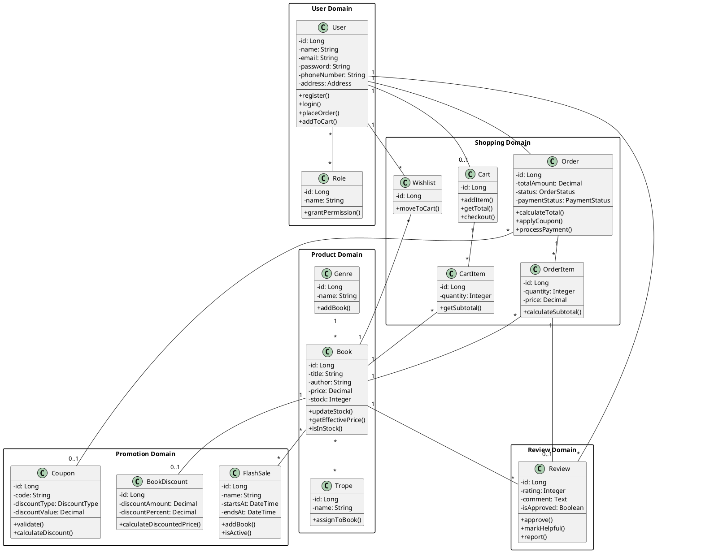
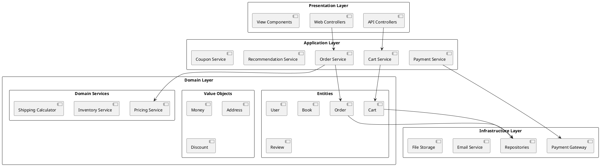

# Bookty E-Commerce - Domain Class Diagram

## 📊 Overview

This document provides a comprehensive **Domain Class Diagram** for the Bookty E-Commerce platform using UML notation. It shows all domain classes, their attributes, methods, and relationships.

### 🆕 Latest Update: Hybrid Pattern Implementation

**Date**: January 2025

The system now implements a **Hybrid Pattern** for shipping prices:
- ✅ **Denormalization** (existing): Fast queries, no JOINs needed
- ✅ **History Table** (new): Full audit trail with accountability

This provides the **best of both worlds**:
- 🚀 **Performance**: Direct access to prices via denormalized fields
- 📜 **Audit Trail**: Complete history of who changed prices, when, and why
- 👤 **Accountability**: Track admin users making price updates
- ✅ **Data Integrity**: Can verify denormalized data matches history

**New Classes**:
- `PostageRateHistory` - Immutable audit records for price changes
- `PostageRateService` - Manages rate updates with automatic history creation

---

## 🎯 UML Class Diagram (PlantUML Format)

### Complete Domain Model

```plantuml
@startuml Bookty E-Commerce Domain Class Diagram

' Styling
skinparam classAttributeIconSize 0
skinparam class {
    BackgroundColor<<Core>> LightBlue
    BackgroundColor<<Product>> LightGreen
    BackgroundColor<<Shopping>> LightYellow
    BackgroundColor<<Promotion>> LightCoral
    BackgroundColor<<Review>> LightPink
    BackgroundColor<<System>> LightGray
}

' ===========================
' CORE USER DOMAIN
' ===========================

class User <<Core>> {
    - id: Long
    - name: String
    - email: String
    - emailVerifiedAt: DateTime
    - password: String
    - phoneNumber: String
    - age: Integer
    - addressLine1: String
    - addressLine2: String
    - city: String
    - state: String
    - postalCode: String
    - country: String
    - rememberToken: String
    - createdAt: DateTime
    - updatedAt: DateTime
    --
    + register(): Boolean
    + login(): Boolean
    + updateProfile(): Boolean
    + verifyEmail(): Boolean
    + placeOrder(): Order
    + addToCart(Book, quantity): CartItem
    + addToWishlist(Book): Wishlist
    + writeReview(Book, rating, comment): Review
    + applyRole(Role): void
}

class Role <<Core>> {
    - id: Long
    - name: String
    - guardName: String
    - createdAt: DateTime
    - updatedAt: DateTime
    --
    + grantPermission(Permission): void
    + revokePermission(Permission): void
}

class Permission <<Core>> {
    - id: Long
    - name: String
    - guardName: String
    - createdAt: DateTime
    - updatedAt: DateTime
}

' ===========================
' PRODUCT CATALOG DOMAIN
' ===========================

class Book <<Product>> {
    - id: Long
    - title: String
    - slug: String
    - author: String
    - synopsis: Text
    - price: Decimal
    - costPrice: Decimal
    - stock: Integer
    - coverImage: String
    - genreId: Long
    - createdAt: DateTime
    - updatedAt: DateTime
    --
    + updateStock(quantity): void
    + applyDiscount(BookDiscount): void
    + getEffectivePrice(): Decimal
    + isInStock(): Boolean
    + calculateProfit(): Decimal
    + addToFlashSale(FlashSale): void
    + assignTrope(Trope): void
}

class Genre <<Product>> {
    - id: Long
    - name: String
    - slug: String
    - description: Text
    - createdAt: DateTime
    - updatedAt: DateTime
    --
    + addBook(Book): void
    + getBookCount(): Integer
}

class Trope <<Product>> {
    - id: Long
    - name: String
    - slug: String
    - description: Text
    - createdAt: DateTime
    - updatedAt: DateTime
    --
    + assignToBook(Book): void
    + getBookCount(): Integer
}

' ===========================
' SHOPPING DOMAIN
' ===========================

class Cart <<Shopping>> {
    - id: Long
    - userId: Long
    - createdAt: DateTime
    - updatedAt: DateTime
    --
    + addItem(Book, quantity): CartItem
    + removeItem(CartItem): void
    + updateQuantity(CartItem, quantity): void
    + clear(): void
    + getTotal(): Decimal
    + getItemCount(): Integer
    + checkout(): Order
}

class CartItem <<Shopping>> {
    - id: Long
    - cartId: Long
    - bookId: Long
    - quantity: Integer
    - createdAt: DateTime
    - updatedAt: DateTime
    --
    + getSubtotal(): Decimal
    + updateQuantity(quantity): void
    + validate(): Boolean
}

class Order <<Shopping>> {
    - id: Long
    - userId: Long
    - publicId: String
    - totalAmount: Decimal
    - status: OrderStatus
    - paymentStatus: PaymentStatus
    - shippingAddress: String
    - shippingCity: String
    - shippingState: String
    - shippingRegion: ShippingRegion
    - shippingCustomerPrice: Decimal (denormalized)
    - shippingActualCost: Decimal (denormalized)
    - postageRateHistoryId: Long (audit FK)
    - isFreeShipping: Boolean
    - shippingPostalCode: String
    - shippingPhone: String
    - adminNotes: Text
    - trackingNumber: String
    - couponId: Long
    - discountAmount: Decimal
    - couponCode: String
    - toyyibpayBillCode: String
    - toyyibpayPaymentUrl: String
    - toyyibpayInvoiceNo: String
    - toyyibpayPaymentDate: DateTime
    - toyyibpaySettlementReference: String
    - toyyibpaySettlementDate: DateTime
    - createdAt: DateTime
    - updatedAt: DateTime
    --
    + calculateTotal(): Decimal
    + applyCoupon(Coupon): Boolean
    + updateStatus(status): void
    + processPayment(): Boolean
    + ship(trackingNumber): void
    + cancel(): void
    + complete(): void
    + calculateProfit(): Decimal
    + getNetAmount(): Decimal
    + verifyShippingPrice(): Boolean
    + getShippingAuditInfo(): Array
}

class OrderItem <<Shopping>> {
    - id: Long
    - orderId: Long
    - bookId: Long
    - quantity: Integer
    - price: Decimal
    - costPrice: Decimal
    - totalSelling: Decimal
    - totalCost: Decimal
    - createdAt: DateTime
    - updatedAt: DateTime
    --
    + calculateSubtotal(): Decimal
    + calculateProfit(): Decimal
    + canReview(): Boolean
}

class Wishlist <<Shopping>> {
    - id: Long
    - userId: Long
    - bookId: Long
    - createdAt: DateTime
    - updatedAt: DateTime
    --
    + moveToCart(): CartItem
    + remove(): void
}

' ===========================
' PROMOTION DOMAIN
' ===========================

class Coupon <<Promotion>> {
    - id: Long
    - code: String
    - description: Text
    - discountType: DiscountType
    - discountValue: Decimal
    - minPurchaseAmount: Decimal
    - maxUsesPerUser: Integer
    - maxUsesTotal: Integer
    - startsAt: DateTime
    - expiresAt: DateTime
    - isActive: Boolean
    - freeShipping: Boolean
    - createdAt: DateTime
    - updatedAt: DateTime
    --
    + validate(User, amount): Boolean
    + calculateDiscount(amount): Decimal
    + isValid(): Boolean
    + canUse(User): Boolean
    + recordUsage(User, Order): CouponUsage
}

class CouponUsage <<Promotion>> {
    - id: Long
    - couponId: Long
    - userId: Long
    - orderId: Long
    - discountAmount: Decimal
    - createdAt: DateTime
    - updatedAt: DateTime
}

class BookDiscount <<Promotion>> {
    - id: Long
    - bookId: Long
    - discountAmount: Decimal
    - discountPercent: Decimal
    - startsAt: DateTime
    - endsAt: DateTime
    - isActive: Boolean
    - description: Text
    - freeShipping: Boolean
    - createdAt: DateTime
    - updatedAt: DateTime
    --
    + isValid(): Boolean
    + calculateDiscountedPrice(originalPrice): Decimal
    + activate(): void
    + deactivate(): void
}

class FlashSale <<Promotion>> {
    - id: Long
    - name: String
    - description: Text
    - startsAt: DateTime
    - endsAt: DateTime
    - discountType: DiscountType
    - discountValue: Decimal
    - freeShipping: Boolean
    - isActive: Boolean
    - createdAt: DateTime
    - updatedAt: DateTime
    --
    + addBook(Book, specialPrice): FlashSaleItem
    + removeBook(Book): void
    + isActive(): Boolean
    + activate(): void
    + deactivate(): void
}

class FlashSaleItem <<Promotion>> {
    - id: Long
    - flashSaleId: Long
    - bookId: Long
    - specialPrice: Decimal
    - createdAt: DateTime
    - updatedAt: DateTime
    --
    + getEffectivePrice(): Decimal
}

' ===========================
' REVIEW DOMAIN
' ===========================

class Review <<Review>> {
    - id: Long
    - userId: Long
    - bookId: Long
    - orderItemId: Long
    - rating: Integer
    - comment: Text
    - images: JSON
    - isApproved: Boolean
    - createdAt: DateTime
    - updatedAt: DateTime
    --
    + approve(): void
    + reject(): void
    + markHelpful(User): ReviewHelpful
    + report(User, reason): ReviewReport
    + getHelpfulCount(): Integer
}

class ReviewHelpful <<Review>> {
    - id: Long
    - reviewId: Long
    - userId: Long
    - createdAt: DateTime
    - updatedAt: DateTime
    --
    + remove(): void
}

class ReviewReport <<Review>> {
    - id: Long
    - reviewId: Long
    - userId: Long
    - adminId: Long
    - reason: String
    - description: Text
    - status: ReportStatus
    - adminNotes: Text
    - reviewedAt: DateTime
    - createdAt: DateTime
    - updatedAt: DateTime
    --
    + review(Admin, action): void
    + resolve(): void
    + dismiss(): void
}

' ===========================
' SYSTEM DOMAIN
' ===========================

class PostageRate <<System>> {
    - id: Long
    - region: ShippingRegion
    - customerPrice: Decimal
    - actualCost: Decimal
    - createdAt: DateTime
    - updatedAt: DateTime
    --
    + getRate(region): PostageRate
    + updateRate(region, price, cost): void
    + getRateForRegion(region): Decimal
    + getProfitMargin(): Float
    + hasHistory(): Boolean
}

class PostageRateHistory <<System>> {
    - id: Long
    - postageRateId: Long
    - customerPrice: Decimal
    - actualCost: Decimal
    - updatedBy: Long
    - comment: Text
    - validFrom: DateTime
    - validUntil: DateTime
    - createdAt: DateTime
    --
    + isCurrent(): Boolean
    + getUpdaterName(): String
    + getProfitMargin(): Float
    + getValidDuration(): String
}

class Setting <<System>> {
    - id: Long
    - key: String
    - value: Text
    - group: String
    - createdAt: DateTime
    - updatedAt: DateTime
    --
    + get(key): String
    + set(key, value): void
    + getGroup(group): Collection
}

class UserBookInteraction <<System>> {
    - id: Long
    - userId: Long
    - bookId: Long
    - interactionType: String
    - createdAt: DateTime
    - updatedAt: DateTime
    --
    + recordView(User, Book): void
    + recordPurchase(User, Book): void
    + recordWishlist(User, Book): void
    + getRecommendations(User): Collection
}

' ===========================
' ENUMERATIONS
' ===========================

enum OrderStatus {
    PENDING
    PROCESSING
    SHIPPED
    COMPLETED
    CANCELLED
}

enum PaymentStatus {
    PENDING
    PAID
    FAILED
    REFUNDED
}

enum ShippingRegion {
    SM
    SABAH
    SARAWAK
    LABUAN
}

enum DiscountType {
    FIXED
    PERCENTAGE
}

enum ReportStatus {
    PENDING
    REVIEWED
    RESOLVED
    DISMISSED
}

' ===========================
' RELATIONSHIPS - USER
' ===========================

User "1" -- "0..1" Cart : has >
User "1" -- "*" Order : places >
User "1" -- "*" Wishlist : has >
User "1" -- "*" Review : writes >
User "1" -- "*" ReviewHelpful : votes >
User "1" -- "*" ReviewReport : reports >
User "1" -- "*" CouponUsage : uses >
User "*" -- "*" Role : has >
User "*" -- "*" Permission : has >

' ===========================
' RELATIONSHIPS - PRODUCT 
' ===========================

Genre "1" -- "*" Book : categorizes >
Book "*" -- "*" Trope : has >
Book "1" -- "0..1" BookDiscount : has discount >
Book "*" -- "*" FlashSale : participates in >
FlashSale "1" -- "*" FlashSaleItem : contains >
FlashSaleItem "*" -- "1" Book : references > 

' ===========================
' RELATIONSHIPS - SHOPPING
' ===========================

Cart "1" -- "*" CartItem : contains > done
CartItem "*" -- "1" Book : references > done

Order "1" -- "*" OrderItem : contains > done
Order "*" -- "1" User : belongs to > X
Order "*" -- "0..1" Coupon : uses > done
OrderItem "*" -- "1" Book : references > done
OrderItem "1" -- "0..1" Review : has > done

Wishlist "*" -- "1" User : belongs to > X
Wishlist "*" -- "1" Book : references > done

' ===========================
' RELATIONSHIPS - PROMOTION
' ===========================

Coupon "1" -- "*" CouponUsage : tracks >done
CouponUsage "*" -- "1" User : used by > x
CouponUsage "*" -- "1" Order : applied to > done

BookDiscount "1" -- "1" Book : applies to >  x

' ===========================
' RELATIONSHIPS - REVIEW
' ===========================

Review "*" -- "1" User : written by > x
Review "*" -- "1" Book : for > done
Review "1" -- "*" ReviewHelpful : has votes > done
Review "1" -- "*" ReviewReport : has reports > done

ReviewHelpful "*" -- "1" User : voted by > x
ReviewReport "*" -- "1" User : reported by > x
ReviewReport "*" -- "0..1" User : reviewed by admin >  x

' ===========================
' RELATIONSHIPS - SYSTEM
' ===========================

UserBookInteraction "*" -- "1" User : tracks >
UserBookInteraction "*" -- "1" Book : tracks >

' HYBRID APPROACH: Denormalization + History Table
' PostageRate has history records (one-to-many)
PostageRate "1" -- "*" PostageRateHistory : has history >

' PostageRateHistory links to User who updated (for accountability)
PostageRateHistory "*" -- "1" User : updated by >

' Order uses BOTH denormalized prices AND history FK (hybrid)
Order "*" -- "0..1" PostageRateHistory : audit trail >
Order ..> PostageRate : <<uses for lookup only>>

' PostageRateHistory has many orders using it
PostageRateHistory "1" -- "*" Order : used in >

' NOTE: Order stores BOTH:
' 1. Denormalized fields (shippingCustomerPrice, shippingActualCost) - FAST queries
' 2. History FK (postageRateHistoryId) - AUDIT trail
' This hybrid approach provides performance AND accountability

' ENUMS USAGE
Order -- OrderStatus
Order -- PaymentStatus
Order -- ShippingRegion
Coupon -- DiscountType
FlashSale -- DiscountType
ReviewReport -- ReportStatus
PostageRate -- ShippingRegion

@enduml
```



---

## 📊 Simplified Domain Class Diagram (Core Entities Only)

For a cleaner view focusing on core business entities:



---

## 📊 Denormalization Pattern Diagram

Visual representation of how postage rates and book prices are denormalized:

```plantuml
@startuml Denormalization Pattern

skinparam componentStyle rectangle

package "Reference Data (Changes Over Time)" {
    component [PostageRate] as PR {
        region: 'sm'
        customer_price: 5.00
        actual_cost: 3.50
    }
    
    component [Book] as Book {
        id: 123
        title: "Book Title"
        price: 45.00
        cost_price: 25.00
        stock: 100
    }
}

package "Order Snapshot (Historical Record)" {
    component [Order] as Order {
        id: 1001
        user_id: 5
        total_amount: 50.00
        --
        **Denormalized:**
        shipping_region: 'sm'
        shipping_customer_price: 5.00
        shipping_actual_cost: 3.50
        coupon_code: 'SAVE10'
    }
    
    component [OrderItem] as OI {
        id: 5001
        order_id: 1001
        book_id: 123
        quantity: 1
        --
        **Denormalized:**
        price: 45.00
        cost_price: 25.00
        total_selling: 45.00
        total_cost: 25.00
    }
}

note right of PR
  Rates can change anytime:
  - Jan 2025: RM 5.00
  - Feb 2025: RM 6.00
  - Mar 2025: RM 5.50
  
  Orders keep original RM 5.00
end note

note right of Book
  Prices can change:
  - Today: RM 45.00
  - Next week: RM 39.90
  - Flash sale: RM 35.00
  
  OrderItems keep original RM 45.00
end note

PR -.-> Order : Lookup ONCE\nat checkout\n(no FK stored)
Book -.-> OI : Lookup ONCE\nat checkout\n(no FK to price)

Order "1" *-- "*" OI

@enduml
```

---

## 🎯 Domain Layers Diagram

Shows the architectural layers and dependencies:



---

## 📋 Class Relationship Summary

> **⚠️ Important Design Note**: `PostageRate` has NO direct foreign key relationship with `Order`. Shipping prices are **denormalized** (copied) into orders at checkout to preserve historical accuracy. See the [Denormalization Pattern](#1-denormalization-pattern-historical-data-preservation) section for details.

### Aggregation Relationships
- **User** aggregates **Cart** (1:0..1) - Cart exists only with User
- **User** aggregates **Wishlist** (1:*) - Wishlist depends on User
- **Cart** aggregates **CartItem** (1:*) - CartItems belong to Cart
- **Order** aggregates **OrderItem** (1:*) - OrderItems belong to Order

### Association Relationships
- **User** ↔ **Order** (1:*) - User places many Orders
- **User** ↔ **Review** (1:*) - User writes many Reviews
- **Book** ↔ **Genre** (*:1) - Books belong to Genre
- **Book** ↔ **Trope** (*:*) - Many-to-many relationship
- **Order** ↔ **Coupon** (*:0..1) - Order may use Coupon

### Composition Relationships
- **FlashSale** composes **FlashSaleItem** (1:*) - FlashSaleItems cannot exist without FlashSale
- **Review** composes **ReviewHelpful** (1:*) - Helpful votes depend on Review
- **Review** composes **ReviewReport** (1:*) - Reports depend on Review

### Dependency Relationships (Hybrid Pattern: Denormalization + History)
- **Order** uses **HYBRID APPROACH** with PostageRate:
  - **Denormalized fields** (for performance):
    - `PostageRate.customer_price` → `Order.shipping_customer_price` (copied for fast queries)
    - `PostageRate.actual_cost` → `Order.shipping_actual_cost` (copied for fast queries)
  - **History FK** (for audit trail):
    - `Order.postage_rate_history_id` → `PostageRateHistory.id` (FK for accountability)
  - **Benefits**: Fast queries + Full audit trail!
  
- **PostageRateHistory** provides:
  - Immutable audit records (no `updated_at` column)
  - Track who changed prices (`updated_by`)
  - Track why prices changed (`comment`)
  - Timeline of all price changes

- **OrderItem** depends on **Book** - Copies prices at time of order (denormalized only)
  - `Book.price` → `OrderItem.price` (denormalized)
  - `Book.cost_price` → `OrderItem.cost_price` (denormalized)

---

## 🔑 Key Domain Patterns

### 1. **Hybrid Pattern (Denormalization + History Table)** ⭐ NEW!

**Problem**: Prices and rates change over time. Need BOTH fast queries AND audit trail.

**Solution**: Use HYBRID approach - denormalize for speed + history table for accountability.

```
Flow at Checkout (HYBRID):
┌──────────────┐         ┌────────────────────┐
│ PostageRate  │    ┌───→│ PostageRate        │
│ region: 'sm' │    │    │ History            │
│ price: 5.00  │────┘    ├────────────────────┤
└──────┬───────┘         │ id: 5              │
       │                 │ customer_price: 5.00│
       │ Lookup          │ actual_cost: 3.50  │
       │                 │ updated_by: Admin  │
       ▼                 │ comment: "..."     │
┌──────────────┐         │ valid_from: now()  │
│    Order     │         │ valid_until: NULL  │
├──────────────┤         └─────────▲──────────┘
│ shipping_    │                   │
│ customer_    │◄─ Denormalized    │
│ price: 5.00  │   (FAST queries)  │
│ shipping_    │                   │
│ actual_cost: │◄─ Denormalized    │
│ 3.50         │   (FAST queries)  │
│              │                   │
│ postage_rate_│                   │
│ history_id:5 │◄──────────────────┘
└──────────────┘   History FK
                   (AUDIT trail)
```

**Hybrid Approach in Your System:**

| Purpose | Source | Target | Field | Benefit |
|---------|--------|--------|-------|---------|
| **Fast Queries** | `postage_rates` | `orders` | `shipping_customer_price` | Direct access, no JOIN |
| **Fast Queries** | `postage_rates` | `orders` | `shipping_actual_cost` | Direct access, no JOIN |
| **Audit Trail** | `postage_rate_history` | `orders` | `postage_rate_history_id` | Who/when/why changed |
| **Fast Queries** | `books` | `order_items` | `price` | Preserve sale price |
| **Fast Queries** | `books` | `order_items` | `cost_price` | Calculate margins |

**Benefits:**
- ✅ **Fast queries** - Uses denormalized fields (no JOINs needed)
- ✅ **Full audit trail** - Track who changed prices and why
- ✅ **Accountability** - Records admin who updated prices
- ✅ **Timeline view** - See all price changes over time
- ✅ **Data verification** - Can verify denormalized matches history
- ✅ **Compliance** - Immutable history records

**Trade-off:**
- ❌ Slight data redundancy (price stored in both places)
- ✅ But get BOTH performance AND accountability!

**Code Example (Hybrid Approach):**
```php
// At Checkout - HYBRID in Action
public function createOrder(Cart $cart, User $user, $shippingRegion)
{
    // 1. Get current history record (not just rate!)
    $historyRecord = PostageRateService::getCurrentHistory($shippingRegion);
    
    $order = new Order([
        'user_id' => $user->id,
        'shipping_region' => $shippingRegion,
        
        // HYBRID APPROACH ✅
        // Part 1: DENORMALIZED (for fast queries)
        'shipping_customer_price' => $historyRecord->customer_price, // ← Fast access
        'shipping_actual_cost' => $historyRecord->actual_cost,       // ← Fast access
        
        // Part 2: HISTORY FK (for audit trail)
        'postage_rate_history_id' => $historyRecord->id,  // ← Accountability
    ]);
    
    // 2. Copy cart items to order items
    foreach ($cart->items as $cartItem) {
        $book = $cartItem->book;
        
        $order->items()->create([
            'book_id' => $book->id,
            'quantity' => $cartItem->quantity,
            
            // Still denormalized (books don't have history yet)
            'price' => $book->price,
            'cost_price' => $book->cost_price,
            'total_selling' => $book->price * $cartItem->quantity,
            'total_cost' => $book->cost_price * $cartItem->quantity,
        ]);
    }
    
    return $order;
}

// Later: Fast query (uses denormalized field)
$revenue = Order::where('payment_status', 'paid')
    ->sum('shipping_customer_price'); // No JOIN needed! ⚡

// Audit query (uses history FK)
$order = Order::with('postageRateHistory.updater')->find(1001);
echo $order->postageRateHistory->updater->name; // Who set this price? 👤
echo $order->postageRateHistory->comment; // Why did price change? 💬
echo $order->verifyShippingPrice(); // Data integrity check ✅
```

---

### 2. **Aggregate Pattern**
```
Order Aggregate Root
├── OrderItem (Entity)
├── Coupon (Reference)
└── User (Reference)
```

**Invariants:**
- Order total must equal sum of OrderItems
- Order status transitions must be valid
- Payment must be completed before shipping

### 2. **Value Objects**
- **Money**: Encapsulates price, cost_price, discount amounts
- **Address**: Shipping address details
- **DateRange**: For flash sales, coupons validity

### 3. **Domain Services**
- **PricingService**: Calculates effective price with discounts
- **ShippingCalculator**: Determines shipping costs
- **InventoryService**: Manages stock levels
- **RecommendationService**: Generates book recommendations
- **PostageRateService**: Manages rate updates with history tracking (NEW!)

### 4. **Repository Pattern**
Each domain entity has a corresponding repository:
- UserRepository
- BookRepository
- OrderRepository
- CartRepository
- ReviewRepository

---

## 📐 Cardinality Legend

| Symbol | Meaning |
|--------|---------|
| `1` | Exactly one |
| `0..1` | Zero or one (optional) |
| `*` | Zero or many |
| `1..*` | One or many |

---

## 🎨 UML Notation Guide

### Class Structure
```
┌─────────────────────┐
│   ClassName         │  ← Class Name
├─────────────────────┤
│ - privateField      │  ← Attributes (- private, + public, # protected)
│ + publicField       │
├─────────────────────┤
│ + publicMethod()    │  ← Operations/Methods
│ - privateMethod()   │
└─────────────────────┘
```

### Relationship Types
- **Association** (──): General relationship
- **Aggregation** (◇──): "Has-a" relationship (weak ownership)
- **Composition** (◆──): "Part-of" relationship (strong ownership)
- **Inheritance** (──▷): "Is-a" relationship
- **Dependency** (⋯>): Uses/depends on

---

## 📊 Domain Statistics

| Category | Count |
|----------|-------|
| **Core Domain Classes** | 21 (added PostageRateHistory) |
| **Enumerations** | 5 |
| **Value Objects** | 3 |
| **Domain Services** | 5 (added PostageRateService) |
| **Aggregates** | 5 |
| **Total Relationships** | 40+ |

---

## 🚀 Usage Instructions

### Viewing the Diagrams

1. **VS Code**: Install "PlantUML" extension
2. **IntelliJ IDEA**: Built-in PlantUML support
3. **Online**: Copy code to http://www.plantuml.com/plantuml/
4. **GitHub**: Some markdown renderers support PlantUML

### Generating Images

```bash
# Install PlantUML
npm install -g node-plantuml

# Generate PNG
plantuml DOMAIN_CLASS_DIAGRAM.md

# Generate SVG
plantuml -tsvg DOMAIN_CLASS_DIAGRAM.md
```

---

## 📝 Domain Rules & Invariants

### User Domain
- Email must be unique
- Users can have multiple roles
- One user can have only one active cart

### Product Domain
- Book price must be >= 0
- Stock cannot be negative
- Each book must belong to exactly one genre
- Books can have multiple tropes

### Shopping Domain
- Cart items quantity must be > 0
- Order total = sum(OrderItems) + shipping - discount
- Order status transitions: PENDING → PROCESSING → SHIPPED → COMPLETED
- Cannot modify order items after order is placed

### Promotion Domain
- Coupon code must be unique
- Discount value must be > 0
- Flash sale date range must be valid
- Only one active book discount per book

### Review Domain
- Rating must be between 1-5
- Review can only be written for purchased books
- One review per order item
- Reviews require admin approval

---

## ❓ FAQ: Why No Foreign Keys for Prices?

### Comparison: With FK vs Without FK (Denormalization)

| Aspect | **With Foreign Key** | **Without FK (Denormalized)** ✓ |
|--------|---------------------|----------------------------------|
| **Data Storage** | `orders.postage_rate_id → postage_rates.id` | `orders.shipping_customer_price = 5.00` |
| **When rate changes** | Order shows NEW price (incorrect!) | Order shows ORIGINAL price ✓ |
| **Historical accuracy** | ❌ Lost | ✅ Preserved |
| **Profit calculation** | ❌ Inaccurate for old orders | ✅ Accurate for any time period |
| **Data integrity** | ❌ Broken if rate deleted | ✅ Safe, data preserved |
| **Database queries** | Requires JOIN to get price | Direct access, faster |
| **Data redundancy** | None | Yes (acceptable trade-off) |

### Real-World Scenario

**January 2025**: Customer orders a book
- Book price: RM 45.00
- Shipping: RM 5.00
- **Total paid**: RM 50.00

**March 2025**: You change rates
- Book price updated to: RM 39.90
- Shipping updated to: RM 6.00

**With FK (Wrong ❌)**:
```sql
SELECT o.total_amount, b.price, pr.customer_price
FROM orders o
JOIN books b ON o.book_id = b.id
JOIN postage_rates pr ON o.postage_rate_id = pr.id
WHERE o.id = 1001;

-- Result: total = 50.00, book = 39.90, shipping = 6.00
-- Problem: 39.90 + 6.00 = 45.90 ≠ 50.00 (WRONG!)
```

**With Denormalization (Correct ✓)**:
```sql
SELECT total_amount, shipping_customer_price 
FROM orders 
WHERE id = 1001;

-- Result: total = 50.00, shipping = 5.00
-- Shows exactly what customer paid ✓
```

---

## 🎯 Domain Boundaries

### Bounded Contexts

1. **Order Management Context**
   - Entities: Order, OrderItem, Cart, CartItem
   - Services: OrderService, CartService

2. **Catalog Context**
   - Entities: Book, Genre, Trope
   - Services: ProductService, InventoryService

3. **Promotion Context**
   - Entities: Coupon, BookDiscount, FlashSale
   - Services: PricingService, CouponService

4. **Review Context**
   - Entities: Review, ReviewHelpful, ReviewReport
   - Services: ReviewService, ModerationService

5. **User Context**
   - Entities: User, Role, Permission
   - Services: AuthenticationService, AuthorizationService

---

This domain class diagram provides a complete object-oriented view of your e-commerce system! 🎉
