# 🎯 Purchase Flow - Domain Class Diagram Perspective

**System**: Bookty E-Commerce  
**Date**: January 2026  
**Focus**: Domain Model Interactions During Purchase

---

## 📋 Table of Contents

1. [Domain Model Overview](#domain-model-overview)
2. [Purchase Flow Class Diagram](#purchase-flow-class-diagram)
3. [Sequence Diagrams](#sequence-diagrams)
4. [Stage-by-Stage Domain Interactions](#stage-by-stage-domain-interactions)
5. [Method Invocations](#method-invocations)
6. [State Transitions](#state-transitions)
7. [Domain Services](#domain-services)

---

## 🏗️ Domain Model Overview

### **Core Domain Classes Involved**


---

## 📊 Purchase Flow Class Diagram

### **Complete Purchase Journey**


---

## 🔄 Sequence Diagrams

### **Stage 1: Add to Cart**


---

### **Stage 2: Checkout Process**


---

### **Stage 3: Order Creation (Atomic Transaction)**

```plantuml
@startuml Order Creation Transaction

participant CheckoutController
participant Database
participant Order
participant OrderItem
participant Book
participant User
participant Cart
participant CartItem
participant PaymentGateway

CheckoutController -> Database: beginTransaction()
activate Database
Database --> CheckoutController: Transaction started
deactivate Database

CheckoutController -> Order: create([...])
activate Order
Order -> Database: INSERT INTO orders (HYBRID data)
activate Database
note right of Database
    Stores:
    - shipping_customer_price (denormalized)
    - shipping_actual_cost (denormalized)
    - postage_rate_history_id (audit FK)
end note
Database --> Order: Order created (ID: 123)
deactivate Database
Order --> CheckoutController: Order object
deactivate Order

loop For each CartItem
    CheckoutController -> Book: lockForUpdate()->first()
    activate Book
    Book -> Database: SELECT * FROM books WHERE id=? FOR UPDATE
    activate Database
    note right of Database: Row locked\nPrevents race conditions
    Database --> Book: Locked book row
    deactivate Database
    Book --> CheckoutController: Locked Book
    
    CheckoutController -> Book: Check stock >= quantity
    Book --> CheckoutController: Stock sufficient
    
    CheckoutController -> OrderItem: create([...])
    activate OrderItem
    OrderItem -> Database: INSERT INTO order_items
    activate Database
    note right of Database
        Snapshots:
        - price (at purchase time)
        - cost_price
        - total_selling
        - total_cost
    end note
    Database --> OrderItem: OrderItem created
    deactivate Database
    OrderItem --> CheckoutController: OrderItem
    deactivate OrderItem
    
    CheckoutController -> Book: decrement('stock', quantity)
    Book -> Database: UPDATE books SET stock = stock - ?
    activate Database
    Database --> Book: Stock updated
    deactivate Database
    Book --> CheckoutController: Updated
    deactivate Book
end

CheckoutController -> PaymentGateway: createBill([bill_data])
activate PaymentGateway
PaymentGateway -> PaymentGateway: Process API request
PaymentGateway --> CheckoutController: {success, bill_code, payment_url}
deactivate PaymentGateway

alt Payment bill created successfully
    CheckoutController -> Order: update([bill_code, payment_url])
    activate Order
    Order -> Database: UPDATE orders SET toyyibpay_bill_code=?, toyyibpay_payment_url=?
    activate Database
    Database --> Order: Updated
    deactivate Database
    Order --> CheckoutController: Updated
    deactivate Order
    
    CheckoutController -> User: Auto-fill profile fields
    activate User
    User -> Database: UPDATE users SET address=?, city=?, ...
    activate Database
    note right: Only updates empty fields\nImproves next checkout
    Database --> User: Profile updated
    deactivate Database
    User --> CheckoutController: Updated
    deactivate User
    
    CheckoutController -> Cart: items()->delete()
    activate Cart
    Cart -> CartItem: delete all
    activate CartItem
    CartItem -> Database: DELETE FROM cart_items WHERE cart_id=?
    activate Database
    Database --> CartItem: Deleted
    deactivate Database
    CartItem --> Cart: Cleared
    deactivate CartItem
    Cart --> CheckoutController: Cart cleared
    deactivate Cart
    
    CheckoutController -> Database: commit()
    activate Database
    note right of Database: ✅ ALL CHANGES PERMANENT
    Database --> CheckoutController: Committed
    deactivate Database
    
    CheckoutController --> CheckoutController: Redirect to payment_url
else Payment bill failed
    CheckoutController -> Database: rollback()
    activate Database
    note right of Database
        ❌ ALL CHANGES UNDONE:
        - Order deleted
        - OrderItems deleted
        - Stock restored
        - Cart remains intact
        - Profile not updated
    end note
    Database --> CheckoutController: Rolled back
    deactivate Database
    
    CheckoutController --> CheckoutController: Return error to user
end

@enduml
```



---

### **Stage 4: Payment Processing**


---

## 📝 Stage-by-Stage Domain Interactions

### **Stage 1: Add to Cart** 🛒

**Domain Classes Involved:**
- User
- Cart
- CartItem
- Book
- UserBookInteraction

**Interactions:**

```
1. User → Authentication
   Method: Auth::user()
   Returns: User instance

2. User → Cart (Relationship)
   Method: user->cart()
   Returns: Cart instance (creates if doesn't exist)

3. Cart → CartItem (Relationship)
   Method: cart->items()->where('book_id', bookId)
   Returns: Existing CartItem or null

4. CartItem → Book (Relationship)
   Method: cartItem->book
   Returns: Book instance

5. Book → Validation
   Method: book->stock >= quantity
   Returns: Boolean (stock check)

6. CartItem → Create/Update
   If exists: cartItem->update(['quantity' => quantity + 1])
   If new: CartItem::create(['cart_id', 'book_id', 'quantity'])

7. UserBookInteraction → Track
   Method: UserBookInteraction::record(userId, bookId, 'cart')
   Purpose: Recommendation system
```

**Domain Model Methods Called:**

```php
// User
$user = Auth::user();
$cart = $user->cart; // Relationship: hasOne(Cart)

// Cart
$cart = Cart::firstOrCreate(['user_id' => $user->id]);
$cartItems = $cart->items; // Relationship: hasMany(CartItem)
$itemCount = $cart->items()->sum('quantity'); // Aggregation

// CartItem
$cartItem = $cart->items()->where('book_id', $book->id)->first();
$cartItem->update(['quantity' => $newQuantity]);
// OR
$cartItem = CartItem::create([
    'cart_id' => $cart->id,
    'book_id' => $book->id,
    'quantity' => 1
]);

// Book
$book = Book::findOrFail($bookId);
$hasStock = $book->stock > 0;

// UserBookInteraction (for recommendations)
UserBookInteraction::record($user->id, $book->id, 'cart');
```

---

### **Stage 2: View Cart** 📋

**Domain Classes Involved:**
- User
- Cart
- CartItem
- Book

**Interactions:**

```
1. User → Cart
   Method: user->cart
   Returns: Cart instance

2. Cart → CartItems (Eager Loading)
   Method: cart->load('items.book')
   Returns: Cart with preloaded items and books

3. Cart → Calculate Subtotal
   Method: cart->items->sum(function($item) {
       return $item->book->price * $item->quantity;
   })
   Returns: Decimal (total subtotal)

4. CartItem → Book Price
   Method: cartItem->book->price
   Returns: Decimal (book price)

5. CartItem → Line Total
   Method: cartItem->book->price * cartItem->quantity
   Returns: Decimal (line item total)
```

**Domain Model Methods:**

```php
// User
$user = Auth::user();

// Cart (with eager loading)
$cart = $user->cart()->with('items.book')->first();

// Calculate subtotal (in view)
$subtotal = 0;
foreach ($cart->items as $item) {
    $lineTotal = $item->book->price * $item->quantity;
    $subtotal += $lineTotal;
}

// Or using collection methods
$subtotal = $cart->items->sum(function($item) {
    return $item->book->price * $item->quantity;
});

// Item count
$itemCount = $cart->items->count();
$totalQuantity = $cart->items->sum('quantity');
```

---

### **Stage 3: Checkout Loading** 💳

**Domain Classes Involved:**
- User
- Cart
- CartItem
- Book
- PostageRateService
- PostageRateHistory
- PostageRate

**Interactions:**

```
1. User → Cart
   Method: user->cart
   Validation: isEmpty()

2. Cart → Eager Load
   Method: cart->load('items.book.genre', 'items.book.active_flash_sale')
   Returns: Fully loaded cart

3. PostageRateService → Get Current History
   Method: postageRateService->getCurrentHistory(region)
   Returns: PostageRateHistory instance

4. PostageRateHistory → PostageRate
   Method: history->postageRate
   Returns: PostageRate instance

5. Book → Check Promotions
   Method: book->active_flash_sale (relationship)
   Method: book->discount (relationship)
   Returns: FlashSale/BookDiscount or null
```

**Domain Model Methods:**

```php
// User & Cart
$cart = Auth::user()->cart;

// Validate cart
if (!$cart || $cart->items->isEmpty()) {
    return redirect()->route('cart.index')
           ->with('error', 'Your cart is empty.');
}

// Eager load relationships
$cart->load('items.book.genre', 'items.book.active_flash_sale', 'items.book.discount');

// Calculate subtotal
$subtotal = $cart->items->sum(function($item) {
    return $item->book->price * $item->quantity;
});

// Get shipping rate (HYBRID approach)
$postageRateService = app(PostageRateService::class);
$historyRecord = $postageRateService->getCurrentHistory($region);

// Access denormalized prices
$shippingCustomerPrice = $historyRecord->customer_price;
$shippingActualCost = $historyRecord->actual_cost;
$historyRecordId = $historyRecord->id; // For audit trail

// Check free shipping from promotions
$isFreeShipping = false;
foreach ($cart->items as $item) {
    $book = $item->book;
    if (($book->active_flash_sale && $book->active_flash_sale->free_shipping) ||
        ($book->discount && $book->discount->free_shipping)) {
        $isFreeShipping = true;
        break;
    }
}
```

---

### **Stage 4: Order Creation (ATOMIC)** 🔐

**Domain Classes Involved:**
- Order
- OrderItem
- Book
- Cart
- CartItem
- PostageRateHistory
- User

**Interactions:**

```
1. DB → Begin Transaction
   Method: DB::beginTransaction()

2. Order → Create
   Method: Order::create([...])
   Includes: HYBRID postage data (denormalized + FK)

3. CartItem → Loop Each Item
   For each item in cart:

4. Book → Lock Row
   Method: book()->lockForUpdate()->first()
   Purpose: Prevent race conditions

5. Book → Validate Stock
   Method: book->stock >= cartItem->quantity
   Critical: Prevents overselling

6. OrderItem → Create
   Method: OrderItem::create([...])
   Snapshots: price, cost_price at purchase time

7. Book → Decrement Stock
   Method: book->decrement('stock', quantity)
   Atomic operation

8. Order → Update Payment Info
   Method: order->update([bill_code, payment_url])

9. User → Auto-fill Profile
   Method: user->update([address, city, state, ...])
   Only if fields empty

10. Cart → Clear Items
    Method: cart->items()->delete()

11. DB → Commit Transaction
    Method: DB::commit()
    OR
    Method: DB::rollback() on error
```

**Domain Model Methods:**

```php
try {
    // 1. Start transaction
    DB::beginTransaction();
    
    // 2. Create Order (HYBRID approach)
    $order = Order::create([
        'user_id' => Auth::id(),
        'total_amount' => $totalAmount,
        'status' => 'pending',
        'payment_status' => 'pending',
        'shipping_address' => $request->shipping_address,
        'shipping_city' => $request->shipping_city,
        'shipping_state' => $request->shipping_state,
        'shipping_region' => $region,
        
        // HYBRID: Denormalized for fast queries
        'shipping_customer_price' => $shippingCustomerPrice,
        'shipping_actual_cost' => $shippingActualCost,
        
        // HYBRID: Audit FK for accountability
        'postage_rate_history_id' => $historyRecordId,
        
        'shipping_postal_code' => $request->shipping_postal_code,
        'shipping_phone' => $request->shipping_phone,
        'is_free_shipping' => $isFreeShipping,
    ]);
    
    // 3. Create Order Items + Update Stock
    foreach ($cart->items as $item) {
        // Lock book row (prevents race conditions)
        $book = $item->book()->lockForUpdate()->first();
        
        // Validate stock AGAIN
        if ($book->stock < $item->quantity) {
            throw new \Exception("Not enough stock for {$book->title}");
        }
        
        // Create order item (snapshot prices)
        OrderItem::create([
            'order_id' => $order->id,
            'book_id' => $item->book_id,
            'quantity' => $item->quantity,
            'price' => $book->price, // Snapshot at purchase time
            'cost_price' => $book->cost_price, // Snapshot
            'total_selling' => $book->price * $item->quantity,
            'total_cost' => ($book->cost_price ?? 0) * $item->quantity,
        ]);
        
        // Decrement stock (atomic)
        $book->decrement('stock', $item->quantity);
    }
    
    // 4. Create payment bill (external API)
    $paymentResult = $this->createToyyibPayBill($billData);
    
    if ($paymentResult['success']) {
        // 5. Update order with payment info
        $order->update([
            'toyyibpay_bill_code' => $paymentResult['bill_code'],
            'toyyibpay_payment_url' => $paymentResult['payment_url'],
        ]);
        
        // 6. Auto-fill user profile
        $user = Auth::user();
        if (empty($user->address_line1)) {
            $user->address_line1 = $request->shipping_address;
        }
        if (empty($user->city)) {
            $user->city = $request->shipping_city;
        }
        // ... etc
        $user->save();
        
        // 7. Clear cart
        $cart->items()->delete();
        
        // 8. Commit transaction
        DB::commit();
        
        // 9. Redirect to payment gateway
        return redirect($paymentResult['payment_url']);
    } else {
        throw new \Exception($paymentResult['message']);
    }
    
} catch (\Exception $e) {
    // Rollback everything
    DB::rollBack();
    
    return back()->with('error', $e->getMessage());
}
```

---

### **Stage 5: Payment Processing** 💰

**Domain Classes Involved:**
- Order
- ToyyibPayController (not a domain class, but orchestrator)

**Interactions:**

```
1. External → ToyyibPay Gateway
   Customer completes payment

2. ToyyibPay → Callback (Server-to-Server)
   Method: POST /toyyibpay/callback
   Reliable: ✅ Guaranteed delivery

3. Order → Find by Bill Code
   Method: Order::where('toyyibpay_bill_code', billCode)->first()

4. Order → Update Payment Status
   If success (status=1):
       payment_status = 'paid'
       status = 'processing'
       toyyibpay_invoice_no = refNo
       toyyibpay_payment_date = now()
   
   If pending (status=2):
       payment_status = 'pending'
   
   If failed (status=3):
       payment_status = 'failed'
       status = 'cancelled'

5. ToyyibPay → Return URL (Browser Redirect)
   Method: GET /toyyibpay/return
   Reliability: ⚠️ Can be missed if browser closed

6. Order → Display Success
   Method: order->load('items.book')
   Shows order confirmation
```

**Domain Model Methods:**

```php
// Callback (Server-to-Server)
public function callback(Request $request)
{
    $billCode = $request->billcode;
    $status = $request->status; // 1=success, 2=pending, 3=failed
    
    // Find order
    $order = Order::where('toyyibpay_bill_code', $billCode)->first();
    
    DB::beginTransaction();
    
    switch ($status) {
        case 1: // Success
            $order->update([
                'payment_status' => 'paid',
                'status' => 'processing',
                'toyyibpay_invoice_no' => $request->refno,
                'toyyibpay_payment_date' => now(),
            ]);
            break;
            
        case 2: // Pending
            $order->update(['payment_status' => 'pending']);
            break;
            
        case 3: // Failed
            $order->update([
                'payment_status' => 'failed',
                'status' => 'cancelled',
            ]);
            break;
    }
    
    DB::commit();
    
    return response()->json(['status' => 'success']);
}

// Return URL (Browser Redirect)
public function return(Request $request)
{
    $statusId = $request->status_id;
    $billCode = $request->billcode;
    
    $order = Order::where('toyyibpay_bill_code', $billCode)->first();
    
    switch ($statusId) {
        case 1: // Success
            return redirect()->route('checkout.success', ['order' => $order->id]);
        case 3: // Failed
            return redirect()->route('profile.orders.show', $order)
                   ->with('error', 'Payment failed.');
    }
}
```

---

## 🎯 Method Invocations Summary

### **Domain Model Methods Used in Purchase Flow**

| Domain Class | Methods Called | Purpose |
|--------------|----------------|---------|
| **User** | `cart()` | Get user's cart (relationship) |
| | `orders()` | Get user's orders (relationship) |
| | `update([profile])` | Auto-fill address/phone |
| **Cart** | `items()` | Get cart items (relationship) |
| | `load('items.book')` | Eager load relationships |
| | `items()->delete()` | Clear cart after order |
| | `isEmpty()` | Validate cart not empty |
| **CartItem** | `create([...])` | Add item to cart |
| | `update(['quantity'])` | Update item quantity |
| | `delete()` | Remove item from cart |
| | `book` | Get book (relationship) |
| **Book** | `findOrFail(id)` | Find book by ID |
| | `lockForUpdate()` | Lock row for transaction |
| | `decrement('stock', qty)` | Reduce stock atomically |
| | `active_flash_sale` | Get active flash sale |
| | `discount` | Get book discount |
| **Order** | `create([...])` | Create new order (HYBRID) |
| | `update([payment])` | Update payment info |
| | `load('items.book')` | Eager load for display |
| | `where('bill_code')` | Find by payment reference |
| **OrderItem** | `create([...])` | Create order item (snapshot) |
| | `book` | Get book (relationship) |
| **PostageRateService** | `getCurrentHistory(region)` | Get current shipping rate |
| **PostageRateHistory** | `current()` | Scope for current record |
| | `postageRate` | Get parent rate |
| **Coupon** | `where('code')->first()` | Find coupon by code |
| | `isValidFor(user, amount)` | Validate coupon |
| | `calculateDiscount(amount)` | Calculate discount |
| **FlashSale** | `isActive()` | Check if sale active |
| **UserBookInteraction** | `record(user, book, type)` | Track for recommendations |

---

## 🔄 State Transitions

### **Cart State Changes**

```
Empty Cart
    ↓ [quickAdd/add]
Cart with 1 item
    ↓ [add more]
Cart with N items
    ↓ [update quantity]
Cart with updated quantities
    ↓ [remove item]
Cart with N-1 items
    ↓ [checkout success]
Empty Cart (items deleted)
```

### **Order Status Flow**

```
(No Order)
    ↓ [checkout process]
Order: status='pending', payment_status='pending'
    ↓ [payment gateway]
    ├── [Payment Success]
    │   Order: status='processing', payment_status='paid'
    │       ↓ [admin ships]
    │   Order: status='shipped'
    │       ↓ [customer receives]
    │   Order: status='delivered'
    │       ↓ [transaction complete]
    │   Order: status='completed'
    │
    └── [Payment Failed]
        Order: status='cancelled', payment_status='failed'
```

### **Book Stock Changes**

```
Book: stock=10
    ↓ [User A adds 2 to cart]
Book: stock=10 (unchanged - not yet ordered)
    ↓ [User A checks out]
    ↓ [Order created - lockForUpdate]
Book: stock=8 (decremented after payment bill created)
    ↓ [User B tries to order 9 copies]
Book: stock=8 (insufficient - order rejected)
```

---

## 🎓 Domain Services

### **PostageRateService**

**Purpose**: Manage shipping rates with audit history (HYBRID approach)

**Methods**:

```php
class PostageRateService
{
    // Get current valid shipping rate for a region
    public function getCurrentHistory(string $region): ?PostageRateHistory
    {
        $postageRate = PostageRate::where('region', $region)->first();
        return $postageRate->currentHistory; // valid_until IS NULL
    }
    
    // Get historical rate at specific time
    public function getRateAt(string $region, Carbon $date): ?PostageRateHistory
    {
        return PostageRateHistory::whereHas('postageRate', function($q) use ($region) {
            $q->where('region', $region);
        })
        ->where('valid_from', '<=', $date)
        ->where(function($q) use ($date) {
            $q->whereNull('valid_until')
              ->orWhere('valid_until', '>=', $date);
        })
        ->first();
    }
    
    // Update rate and create history
    public function updateRate(string $region, array $prices, string $comment): PostageRateHistory
    {
        DB::transaction(function() use ($region, $prices, $comment) {
            // Close current history
            $currentHistory = $this->getCurrentHistory($region);
            if ($currentHistory) {
                $currentHistory->update(['valid_until' => now()]);
            }
            
            // Create new history
            return PostageRateHistory::create([
                'postage_rate_id' => $postageRate->id,
                'customer_price' => $prices['customer_price'],
                'actual_cost' => $prices['actual_cost'],
                'updated_by' => Auth::id(),
                'comment' => $comment,
                'valid_from' => now(),
                'valid_until' => null, // Current
            ]);
        });
    }
}
```

**Used In Purchase Flow**:

```php
// During checkout
$postageRateService = app(PostageRateService::class);
$historyRecord = $postageRateService->getCurrentHistory($region);

// Store BOTH denormalized and FK
$order->shipping_customer_price = $historyRecord->customer_price; // Fast
$order->shipping_actual_cost = $historyRecord->actual_cost; // Fast
$order->postage_rate_history_id = $historyRecord->id; // Audit
```

---

## 📊 Summary: Domain Classes in Purchase Flow

### **Complete Journey Through Domain Model**

```
User
  └─→ Cart
       └─→ CartItem (N)
            └─→ Book (with stock check)
                 └─→ UserBookInteraction (tracking)

User clicks "Checkout"
  └─→ Cart (validation)
       └─→ CartItem (eager loaded)
            └─→ Book (with promotions)
                 ├─→ FlashSale (check free shipping)
                 └─→ BookDiscount (check free shipping)

PostageRateService
  └─→ PostageRateHistory
       └─→ PostageRate (parent reference)

[ATOMIC TRANSACTION START]

Order (created with HYBRID postage data)
  ├─→ PostageRateHistory (audit FK)
  └─→ OrderItem (N)
       └─→ Book
            └─→ lockForUpdate() → decrement('stock')

Cart
  └─→ items()->delete()

User
  └─→ update([profile]) (auto-fill)

[TRANSACTION COMMIT]

Order
  └─→ update([payment info from ToyyibPay])

[Payment Gateway Processing]

Order
  └─→ update([payment_status, invoice_no])

[Success Page]

Order
  └─→ load('items.book') (display confirmation)
```

---

## 🎯 Key Domain Model Patterns

### **1. Relationships**

```php
// User → Cart (One-to-One)
$cart = $user->cart;

// Cart → CartItems (One-to-Many)
$items = $cart->items;

// CartItem/OrderItem → Book (Many-to-One)
$book = $item->book;

// Order → OrderItems (One-to-Many)
$items = $order->items;

// Order → PostageRateHistory (Many-to-One)
$history = $order->postageRateHistory;

// PostageRateHistory → PostageRate (Many-to-One)
$rate = $history->postageRate;
```

### **2. Eager Loading**

```php
// Load relationships in one query
$cart = Cart::with('items.book.genre')->find($id);

// Multiple relationships
$order = Order::with([
    'items.book',
    'postageRateHistory.postageRate',
    'user'
])->find($id);
```

### **3. Atomic Operations**

```php
// Stock decrement (atomic)
$book->decrement('stock', $quantity);

// Equivalent to:
DB::table('books')
  ->where('id', $book->id)
  ->update(['stock' => DB::raw('stock - ?')], [$quantity]);
```

### **4. Row Locking**

```php
// Prevent race conditions
$book = Book::where('id', $bookId)->lockForUpdate()->first();
// Other transactions wait until this transaction commits/rolls back
```

### **5. Transactions**

```php
DB::transaction(function() {
    // All operations succeed or all fail
    Order::create([...]);
    OrderItem::create([...]);
    $book->decrement('stock', $qty);
    $cart->items()->delete();
});
```

---

## ✅ Complete Domain Flow Summary

Your purchase system uses **well-designed domain models** with:

✅ **Clear Relationships** - Proper use of Eloquent relationships  
✅ **Atomic Operations** - Database transactions ensure consistency  
✅ **Row Locking** - Prevents race conditions in stock management  
✅ **Eager Loading** - Optimized queries with relationship preloading  
✅ **HYBRID Pattern** - Fast queries + audit trails for shipping  
✅ **State Management** - Clear status transitions for orders  
✅ **Domain Services** - PostageRateService encapsulates business logic  
✅ **Tracking** - UserBookInteraction for recommendations  
✅ **Snapshot Pattern** - OrderItem stores prices at purchase time  

This is a **production-grade domain model** implementation! 🎉
