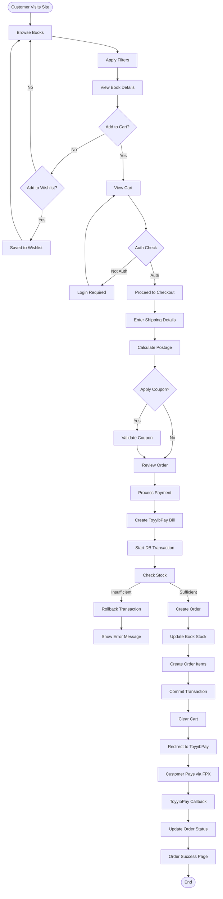
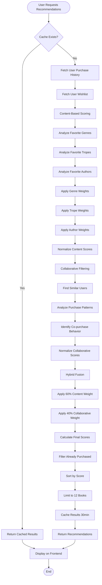
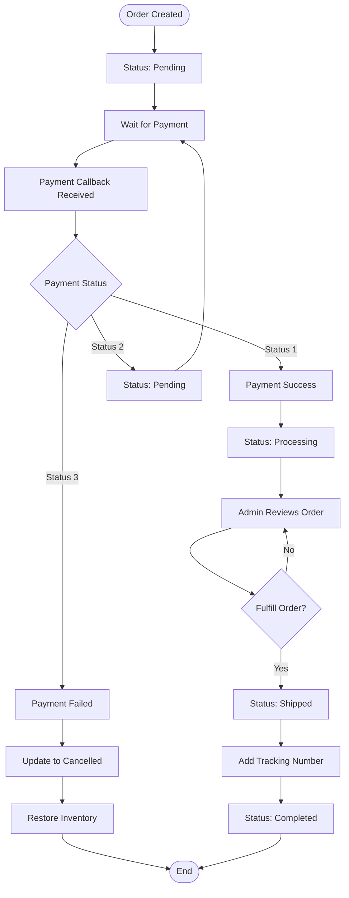
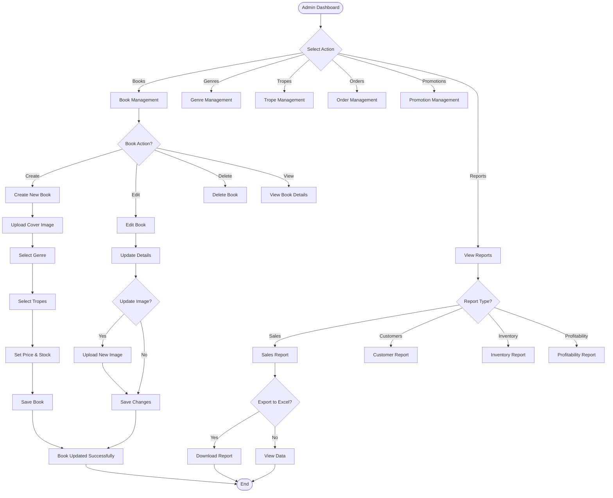
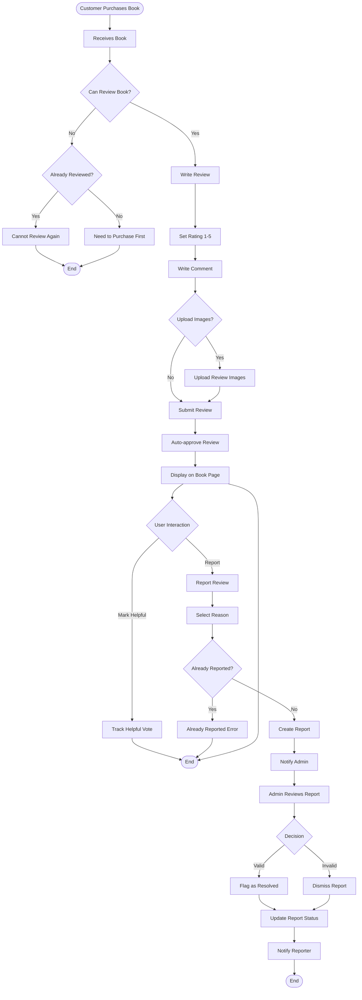
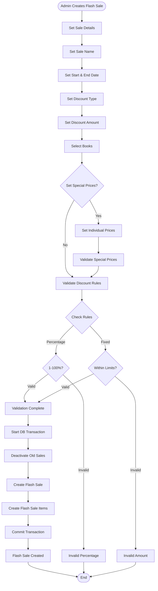
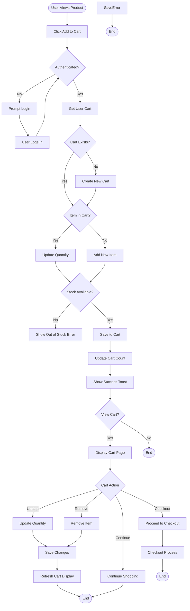
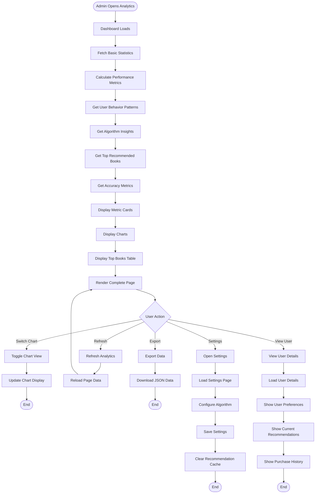

# Bookty E-Commerce System - Complete Analysis & Activity Diagrams

## 📋 Table of Contents
1. [System Overview](#system-overview)
2. [Core Features](#core-features)
3. [User Roles & Permissions](#user-roles--permissions)
4. [Database Architecture](#database-architecture)
5. [Activity Diagrams](#activity-diagrams)
6. [System Workflows](#system-workflows)
7. [Integration Points](#integration-points)

---

## 🎯 System Overview

**Bookty** is a sophisticated Laravel-based e-commerce platform specializing in book sales with advanced features including:
- **Hybrid Recommendation System** (Content-Based + Collaborative Filtering)
- **Multi-role Access Control** (Superadmin, Admin, Customer)
- **Payment Integration** (ToyyibPay - Malaysian FPX)
- **Advanced Promotion Systems** (Flash Sales, Discounts, Coupons)
- **Review & Rating System** with image uploads
- **Comprehensive Admin Dashboard** with analytics
- **Profitability Tracking** with cost analysis

### Tech Stack
- **Backend**: Laravel 11.x
- **Frontend**: Blade Templates + Tailwind CSS + Flowbite + Alpine.js
- **Database**: MySQL with Eloquent ORM
- **Payment**: ToyyibPay (Malaysian FPX)
- **Authentication**: Laravel Breeze + Spatie Permissions
- **Charts**: Chart.js
- **Export**: Maatwebsite Excel

---

## 🚀 Core Features

### 1. Customer Features
- **User Registration & Authentication** (Email/Password + Google OAuth)
- **Book Browsing** (By genre, trope, author, price filters)
- **Advanced Search & Filtering**
- **Personalized Recommendations** (Homepage, Book Detail, Cart)
- **Shopping Cart** (Add, Update, Remove items)
- **Wishlist Management**
- **Order Processing** with real-time stock check
- **Payment Integration** (ToyyibPay - Malaysian banking)
- **Order History & Tracking**
- **Invoice Generation & Download**
- **Book Reviews** (With image uploads)
- **Review Interactions** (Helpful votes, reporting)

### 2. Admin Features
- **Dashboard Analytics** (Sales, Customers, Orders, Revenue)
- **Book Management** (CRUD operations, image uploads)
- **Genre & Trope Management**
- **Order Management** (View, Update Status, Process Orders)
- **Customer Management** (View profiles, order history)
- **Promotion Management** (Flash Sales, Discounts, Coupons)
- **Inventory Management** (Stock monitoring)
- **Reports & Analytics** (Sales, Customers, Profitability, Inventory)
- **Review Moderation** (Helpful votes, reports management)
- **Postage Rate Management** (SM, Sabah, Sarawak)
- **Recommendation Analytics** (Performance monitoring, user insights)

### 3. Superadmin Features
- **Complete System Access**
- **Admin User Management** (Create, Edit, Delete admin accounts)
- **Role & Permission Management**
- **System Settings Configuration**
- **Real-time Dashboard** (API endpoints for stats)
- **System Health Monitoring**

---

## 👥 User Roles & Permissions

### Roles
1. **Superadmin** - Full system control
2. **Admin** - Manage products, orders, customers, reports
3. **Customer** - Browse, purchase, review books

### Key Permissions
```php
Book Management: view, create, edit, delete
Genre Management: view, create, edit, delete
Trope Management: view, create, edit, delete
Order Management: view, manage
Customer Management: view
Admin Access: access admin panel
```

---

## 🗄️ Database Architecture

### Core Tables

#### Users & Authentication
- **users** - User accounts with profile information
- **model_has_permissions** - Permission assignments
- **model_has_roles** - Role assignments

#### Product Catalog
- **genres** - Book genres (Fiction, Romance, etc.)
- **tropes** - Story tropes (Enemies to Lovers, etc.)
- **books** - Product information with pricing & stock
- **book_trope** - Pivot table for book-trope relationships

#### Shopping & Orders
- **carts** - User shopping carts
- **cart_items** - Items in cart
- **orders** - Customer orders
- **order_items** - Order line items with cost tracking

#### Promotions
- **book_discounts** - Individual book discounts
- **coupons** - Store-wide coupon codes
- **coupon_usages** - Coupon usage tracking
- **flash_sales** - Time-limited sales
- **flash_sale_items** - Books in flash sales

#### Reviews & Feedback
- **reviews** - Customer reviews with ratings & images
- **review_helpfuls** - Helpful vote tracking
- **review_reports** - Inappropriate content reports

#### User Engagement
- **wishlists** - User wishlist items

#### Shipping
- **postage_rates** - Shipping rates by region (SM, Sabah, Sarawak)

#### System Configuration
- **settings** - System-wide configuration

---

## 📊 Activity Diagrams

### 1. Customer Purchase Flow



### 2. Hybrid Recommendation System Flow



### 3. Order Processing & Fulfillment Flow



### 4. Admin Product Management Flow



### 5. Review & Moderation Flow



### 6. Flash Sale Creation Flow



### 7. Cart Management Flow



### 8. Recommendation Analytics Dashboard Flow



---

## 🔄 System Workflows

### A. Customer Journey
1. **Registration** → Email/Google OAuth → Customer Role
2. **Browsing** → Filter by Genre/Trope/Author → View Book Details
3. **Discovery** → Receive Personalized Recommendations → Add to Cart
4. **Purchase** → Add to Cart → Proceed to Checkout → Enter Shipping → Apply Coupon → Process Payment → Order Confirmation
5. **Post-Purchase** → Review Product → Leave Review with Images
6. **Account Management** → View Orders → Download Invoice → Track Shipment

### B. Admin Operations
1. **Inventory Management** → Add Books → Set Prices → Manage Stock
2. **Order Fulfillment** → View Orders → Update Status → Add Tracking → Mark Complete
3. **Promotion Management** → Create Flash Sales → Set Discounts → Manage Coupons
4. **Analytics** → View Reports → Export Data → Monitor Performance
5. **Recommendation Management** → Configure Algorithm → Monitor Analytics → Tune Settings

### C. Payment Processing
1. **Order Creation** → Calculate Totals → Create ToyyibPay Bill → Redirect to Payment
2. **ToyyibPay Integration** → Create Bill → Customer Pays via FPX → Receive Callback
3. **Order Update** → Update Payment Status → Update Order Status → Notify Customer
4. **Inventory Update** → Lock Stock → Process Order → Decrement Stock → Commit Transaction

---

## 🔌 Integration Points

### 1. ToyyibPay Payment Gateway
- **Create Bill API**: Creates payment bill for each order
- **Callback URL**: Server-side payment notification
- **Return URL**: Customer redirect after payment
- **Status Handling**: Success, Pending, Failed states

### 2. Google OAuth
- **Social Login**: Alternative authentication method
- **User Registration**: Automatic account creation
- **Email Verification**: Auto-verified for Google accounts

### 3. Recommendation System
- **Content-Based**: Genre, Trope, Author analysis
- **Collaborative**: User similarity, co-purchase patterns
- **Caching**: Redis/Laravel Cache for performance
- **Real-time Updates**: AJAX-powered dynamic loading

### 4. Admin Analytics
- **Dashboard Charts**: Chart.js visualization
- **Export Functionality**: Excel export via Maatwebsite
- **Real-time Stats**: AJAX endpoints for live updates

---

## 📈 Key Metrics & Analytics

### Customer Metrics
- Total Users
- Active Customers
- Repeat Purchase Rate
- Average Order Value
- Customer Lifetime Value

### Product Metrics
- Total Books
- Low Stock Alerts
- Bestsellers (by revenue & units)
- Genre/Trope Popularity
- Profit Margins by Book

### Sales Metrics
- Total Revenue
- Orders Count
- Conversion Rate
- Average Transaction Value
- Promotion Effectiveness

### Recommendation Metrics
- Recommendation Coverage (users with recommendations)
- Click-Through Rate (CTR)
- Conversion Rate from Recommendations
- Algorithm Effectiveness (content vs collaborative)
- Accuracy Metrics (Precision, Recall, F1 Score)

### Order Metrics
- Order Status Distribution
- Average Shipping Time
- Cancellation/Refund Rate
- Payment Success Rate

---

## 🎨 Technical Highlights

### Performance Optimizations
1. **Caching**: Recommendations cached for 30 minutes
2. **Database Indexing**: Optimized queries on frequently accessed columns
3. **Eager Loading**: Prevents N+1 query problems
4. **AJAX Loading**: Asynchronous recommendation loading
5. **Image Optimization**: Cloudinary or similar for images
6. **Lazy Loading**: Deferred loading of non-critical resources

### Security Features
1. **CSRF Protection**: All forms protected
2. **Authentication Middleware**: Role-based access control
3. **Input Validation**: Server-side validation on all inputs
4. **SQL Injection Prevention**: Eloquent ORM usage
5. **XSS Protection**: Blade template escaping
6. **Password Hashing**: Bcrypt encryption
7. **Session Security**: Secure session handling

### Scalability Features
1. **Database Transactions**: Atomic operations
2. **Queue System**: Background job processing
3. **Caching Strategy**: Multi-level caching
4. **API Endpoints**: RESTful API design
5. **Modular Architecture**: Service-based design

---

## 🔮 Future Enhancements

### Potential Improvements
1. **Machine Learning Integration**: TensorFlow/PyTorch for advanced recommendations
2. **Real-time Chat**: Live customer support
3. **Mobile App**: React Native or Flutter
4. **Advanced Analytics**: Business Intelligence dashboard
5. **Email Marketing**: Automated campaigns
6. **Inventory Automation**: Auto-reorder notifications
7. **Multi-currency Support**: International expansion
8. **Advanced Search**: Elasticsearch integration
9. **Social Features**: Book clubs, reading groups
10. **PWA Support**: Progressive Web App capabilities

---

## 📝 Conclusion

The Bookty E-commerce platform is a comprehensive, feature-rich system with sophisticated recommendation capabilities, robust order processing, and extensive administrative tools. The hybrid recommendation system, combined with advanced analytics and promotion management, provides a competitive edge in the online book retail market.

### System Complexity
- **High Complexity Features**:
  - Hybrid Recommendation System
  - Real-time Payment Processing
  - Profitability Tracking
  - Advanced Analytics Dashboard
  - Multi-role Access Control
  - Promotion Management System
  - Review Moderation Workflow

- **Business Intelligence Features**:
  - Sales Reporting
  - Customer Segmentation
  - Inventory Analytics
  - Recommendation Performance Tracking
  - Profitability Analysis

This system demonstrates enterprise-level architecture with attention to scalability, performance, security, and user experience.

