# Bookty E-Commerce - Use Case Diagram

## 📊 Overview

This document provides a comprehensive Use Case Diagram for the Bookty E-Commerce platform, showing all actors, use cases, and their relationships.

---

## 👥 Actors

1. **Guest** - Unauthenticated visitor
2. **Customer** - Authenticated user (registered customer)
3. **Admin** - Store administrator
4. **SuperAdmin** - System administrator
5. **Payment Gateway** - External payment system (ToyyibPay)

---

## 📐 Use Case Diagram

### PlantUML Format (Recommended for Professional Tools)

```plantuml
@startuml Bookty E-Commerce Use Case Diagram

!define RECTANGLE class

' Actors
actor Guest as guest
actor Customer as customer
actor Admin as admin
actor SuperAdmin as superadmin
actor "Payment Gateway\n(ToyyibPay)" as payment

' System Boundary
rectangle "Bookty E-Commerce System" {
  
  ' Guest Use Cases
  package "Guest Use Cases" {
    usecase UC1 as "Browse Books"
    usecase UC2 as "View Book Details"
    usecase UC3 as "Search Books"
    usecase UC4 as "Filter Books"
    usecase UC5 as "View About Page"
    usecase UC6 as "Register Account"
    usecase UC7 as "Login"
    usecase UC8 as "Google OAuth Login"
  }
  
  ' Customer Use Cases
  package "Customer Use Cases" {
    usecase UC9 as "Manage Profile"
    usecase UC10 as "Add to Cart"
    usecase UC11 as "Update Cart"
    usecase UC12 as "Remove from Cart"
    usecase UC13 as "View Cart"
    usecase UC14 as "Add to Wishlist"
    usecase UC15 as "Remove from Wishlist"
    usecase UC16 as "View Wishlist"
    usecase UC17 as "Checkout"
    usecase UC18 as "Apply Coupon"
    usecase UC19 as "Calculate Shipping"
    usecase UC20 as "View Order History"
    usecase UC21 as "View Order Details"
    usecase UC22 as "Download Invoice"
    usecase UC23 as "Write Review"
    usecase UC24 as "Upload Review Images"
    usecase UC25 as "Mark Review as Helpful"
    usecase UC26 as "Report Review"
    usecase UC27 as "View Recommendations"
    usecase UC28 as "Process Payment"
  }
  
  ' Admin Use Cases
  package "Admin Use Cases" {
    usecase UC29 as "View Dashboard"
    usecase UC30 as "Manage Books"
    usecase UC31 as "Manage Genres"
    usecase UC32 as "Manage Tropes"
    usecase UC33 as "Manage Orders"
    usecase UC34 as "Update Order Status"
    usecase UC35 as "View Customers"
    usecase UC36 as "Manage Discounts"
    usecase UC37 as "Manage Coupons"
    usecase UC38 as "Manage Flash Sales"
    usecase UC39 as "View Sales Reports"
    usecase UC40 as "View Customer Reports"
    usecase UC41 as "View Inventory Reports"
    usecase UC42 as "View Promotion Reports"
    usecase UC43 as "View Shipping Reports"
    usecase UC44 as "View Profitability Reports"
    usecase UC45 as "Export Reports"
    usecase UC46 as "Manage Review Reports"
    usecase UC47 as "View Review Analytics"
    usecase UC48 as "Manage Postage Rates"
    usecase UC49 as "View Recommendation Analytics"
    usecase UC50 as "Manage System Settings"
  }
  
  ' SuperAdmin Use Cases
  package "SuperAdmin Use Cases" {
    usecase UC51 as "Manage Admins"
    usecase UC52 as "Manage Roles"
    usecase UC53 as "Manage Permissions"
    usecase UC54 as "View System Health"
    usecase UC55 as "Configure System Settings"
  }
  
  ' Payment Gateway Use Cases
  package "Payment Gateway Use Cases" {
    usecase UC56 as "Process Payment Callback"
    usecase UC57 as "Return Payment Status"
  }
}

' Guest Relationships
guest --> UC1
guest --> UC2
guest --> UC3
guest --> UC4
guest --> UC5
guest --> UC6
guest --> UC7
guest --> UC8

' Customer Relationships (inherits Guest)
customer --> UC1
customer --> UC2
customer --> UC3
customer --> UC4
customer --> UC5
customer --> UC9
customer --> UC10
customer --> UC11
customer --> UC12
customer --> UC13
customer --> UC14
customer --> UC15
customer --> UC16
customer --> UC17
customer --> UC18
customer --> UC19
customer --> UC20
customer --> UC21
customer --> UC22
customer --> UC23
customer --> UC24
customer --> UC25
customer --> UC26
customer --> UC27
customer --> UC28

' Admin Relationships (inherits Customer)
admin --> UC29
admin --> UC30
admin --> UC31
admin --> UC32
admin --> UC33
admin --> UC34
admin --> UC35
admin --> UC36
admin --> UC37
admin --> UC38
admin --> UC39
admin --> UC40
admin --> UC41
admin --> UC42
admin --> UC43
admin --> UC44
admin --> UC45
admin --> UC46
admin --> UC47
admin --> UC48
admin --> UC49
admin --> UC50

' SuperAdmin Relationships (inherits Admin)
superadmin --> UC51
superadmin --> UC52
superadmin --> UC53
superadmin --> UC54
superadmin --> UC55

' Payment Gateway Relationships
payment --> UC56
payment --> UC57

' Use Case Relationships
UC17 ..> UC18 : <<include>>
UC17 ..> UC19 : <<include>>
UC17 ..> UC28 : <<include>>
UC28 ..> UC56 : <<include>>
UC23 ..> UC24 : <<include>>
UC30 ..> UC31 : <<extend>>
UC30 ..> UC32 : <<extend>>
UC33 ..> UC34 : <<extend>>
UC39 ..> UC45 : <<extend>>
UC40 ..> UC45 : <<extend>>
UC41 ..> UC45 : <<extend>>
UC42 ..> UC45 : <<extend>>
UC43 ..> UC45 : <<extend>>
UC44 ..> UC45 : <<extend>>

@enduml
```



---

### Mermaid Format (GitHub Compatible)

```mermaid
graph TB
    subgraph Actors
        Guest[Guest]
        Customer[Customer]
        Admin[Admin]
        SuperAdmin[SuperAdmin]
        Payment[Payment Gateway<br/>ToyyibPay]
    end
    
    subgraph "Bookty E-Commerce System"
        subgraph "Guest Use Cases"
            UC1[Browse Books]
            UC2[View Book Details]
            UC3[Search Books]
            UC4[Filter Books]
            UC5[View About Page]
            UC6[Register Account]
            UC7[Login]
            UC8[Google OAuth Login]
        end
        
        subgraph "Customer Use Cases"
            UC9[Manage Profile]
            UC10[Add to Cart]
            UC11[Update Cart]
            UC12[Remove from Cart]
            UC13[View Cart]
            UC14[Add to Wishlist]
            UC15[Remove from Wishlist]
            UC16[View Wishlist]
            UC17[Checkout]
            UC18[Apply Coupon]
            UC19[Calculate Shipping]
            UC20[View Order History]
            UC21[View Order Details]
            UC22[Download Invoice]
            UC23[Write Review]
            UC24[Upload Review Images]
            UC25[Mark Review as Helpful]
            UC26[Report Review]
            UC27[View Recommendations]
            UC28[Process Payment]
        end
        
        subgraph "Admin Use Cases"
            UC29[View Dashboard]
            UC30[Manage Books]
            UC31[Manage Genres]
            UC32[Manage Tropes]
            UC33[Manage Orders]
            UC34[Update Order Status]
            UC35[View Customers]
            UC36[Manage Discounts]
            UC37[Manage Coupons]
            UC38[Manage Flash Sales]
            UC39[View Sales Reports]
            UC40[View Customer Reports]
            UC41[View Inventory Reports]
            UC42[View Promotion Reports]
            UC43[View Shipping Reports]
            UC44[View Profitability Reports]
            UC45[Export Reports]
            UC46[Manage Review Reports]
            UC47[View Review Analytics]
            UC48[Manage Postage Rates]
            UC49[View Recommendation Analytics]
            UC50[Manage System Settings]
        end
        
        subgraph "SuperAdmin Use Cases"
            UC51[Manage Admins]
            UC52[Manage Roles]
            UC53[Manage Permissions]
            UC54[View System Health]
            UC55[Configure System Settings]
        end
        
        subgraph "Payment Gateway Use Cases"
            UC56[Process Payment Callback]
            UC57[Return Payment Status]
        end
    end
    
    %% Guest Relationships
    Guest --> UC1
    Guest --> UC2
    Guest --> UC3
    Guest --> UC4
    Guest --> UC5
    Guest --> UC6
    Guest --> UC7
    Guest --> UC8
    
    %% Customer Relationships
    Customer --> UC1
    Customer --> UC2
    Customer --> UC3
    Customer --> UC4
    Customer --> UC5
    Customer --> UC9
    Customer --> UC10
    Customer --> UC11
    Customer --> UC12
    Customer --> UC13
    Customer --> UC14
    Customer --> UC15
    Customer --> UC16
    Customer --> UC17
    Customer --> UC18
    Customer --> UC19
    Customer --> UC20
    Customer --> UC21
    Customer --> UC22
    Customer --> UC23
    Customer --> UC24
    Customer --> UC25
    Customer --> UC26
    Customer --> UC27
    Customer --> UC28
    
    %% Admin Relationships
    Admin --> UC29
    Admin --> UC30
    Admin --> UC31
    Admin --> UC32
    Admin --> UC33
    Admin --> UC34
    Admin --> UC35
    Admin --> UC36
    Admin --> UC37
    Admin --> UC38
    Admin --> UC39
    Admin --> UC40
    Admin --> UC41
    Admin --> UC42
    Admin --> UC43
    Admin --> UC44
    Admin --> UC45
    Admin --> UC46
    Admin --> UC47
    Admin --> UC48
    Admin --> UC49
    Admin --> UC50
    
    %% SuperAdmin Relationships
    SuperAdmin --> UC51
    SuperAdmin --> UC52
    SuperAdmin --> UC53
    SuperAdmin --> UC54
    SuperAdmin --> UC55
    
    %% Payment Gateway Relationships
    Payment --> UC56
    Payment --> UC57
    
    %% Use Case Relationships
    UC17 -.->|includes| UC18
    UC17 -.->|includes| UC19
    UC17 -.->|includes| UC28
    UC28 -.->|includes| UC56
    UC23 -.->|includes| UC24
    UC30 -.->|extends| UC31
    UC30 -.->|extends| UC32
    UC33 -.->|extends| UC34
    UC39 -.->|extends| UC45
    UC40 -.->|extends| UC45
    UC41 -.->|extends| UC45
    UC42 -.->|extends| UC45
    UC43 -.->|extends| UC45
    UC44 -.->|extends| UC45
```



---

## 📋 Detailed Use Case Descriptions

### Guest Use Cases

| ID | Use Case | Description |
|----|----------|-------------|
| UC1 | Browse Books | View list of available books with pagination |
| UC2 | View Book Details | See detailed information about a specific book |
| UC3 | Search Books | Search books by title, author, or keywords |
| UC4 | Filter Books | Filter books by genre, trope, author, price range |
| UC5 | View About Page | View information about the company |
| UC6 | Register Account | Create a new customer account |
| UC7 | Login | Authenticate with email and password |
| UC8 | Google OAuth Login | Authenticate using Google account |

---

### Customer Use Cases

| ID | Use Case | Description |
|----|----------|-------------|
| UC9 | Manage Profile | Update personal information and address |
| UC10 | Add to Cart | Add book to shopping cart with quantity |
| UC11 | Update Cart | Modify quantity of items in cart |
| UC12 | Remove from Cart | Remove item from shopping cart |
| UC13 | View Cart | View all items in shopping cart |
| UC14 | Add to Wishlist | Add book to personal wishlist |
| UC15 | Remove from Wishlist | Remove book from wishlist |
| UC16 | View Wishlist | View all wishlisted books |
| UC17 | Checkout | Complete purchase process |
| UC18 | Apply Coupon | Apply discount coupon code |
| UC19 | Calculate Shipping | Calculate shipping cost based on region |
| UC20 | View Order History | View list of past orders |
| UC21 | View Order Details | View detailed information about an order |
| UC22 | Download Invoice | Download PDF invoice for an order |
| UC23 | Write Review | Submit review and rating for purchased book |
| UC24 | Upload Review Images | Upload images with review |
| UC25 | Mark Review as Helpful | Vote helpful on a review |
| UC26 | Report Review | Report inappropriate review content |
| UC27 | View Recommendations | View personalized book recommendations |
| UC28 | Process Payment | Complete payment via ToyyibPay |

---

### Admin Use Cases

| ID | Use Case | Description |
|----|----------|-------------|
| UC29 | View Dashboard | View analytics dashboard with key metrics |
| UC30 | Manage Books | Create, read, update, delete books |
| UC31 | Manage Genres | Create, update, delete book genres |
| UC32 | Manage Tropes | Create, update, delete story tropes |
| UC33 | Manage Orders | View and manage customer orders |
| UC34 | Update Order Status | Change order status (pending, processing, shipped, completed, cancelled) |
| UC35 | View Customers | View customer profiles and order history |
| UC36 | Manage Discounts | Create and manage book-specific discounts |
| UC37 | Manage Coupons | Create and manage store-wide coupon codes |
| UC38 | Manage Flash Sales | Create and manage time-limited flash sales |
| UC39 | View Sales Reports | View sales analytics and charts |
| UC40 | View Customer Reports | View customer analytics and insights |
| UC41 | View Inventory Reports | View stock levels and inventory analytics |
| UC42 | View Promotion Reports | View promotion performance analytics |
| UC43 | View Shipping Reports | View shipping cost and revenue analytics |
| UC44 | View Profitability Reports | View profit margins and cost analysis |
| UC45 | Export Reports | Export reports to Excel/PDF format |
| UC46 | Manage Review Reports | Review and moderate reported reviews |
| UC47 | View Review Analytics | View review helpful votes and statistics |
| UC48 | Manage Postage Rates | Set shipping rates for different regions |
| UC49 | View Recommendation Analytics | View recommendation system performance |
| UC50 | Manage System Settings | Configure system-wide settings |

---

### SuperAdmin Use Cases

| ID | Use Case | Description |
|----|----------|-------------|
| UC51 | Manage Admins | Create, update, delete admin accounts |
| UC52 | Manage Roles | Create and manage user roles |
| UC53 | Manage Permissions | Create and assign permissions to roles |
| UC54 | View System Health | Monitor system performance and health |
| UC55 | Configure System Settings | Configure global system settings |

---

### Payment Gateway Use Cases

| ID | Use Case | Description |
|----|----------|-------------|
| UC56 | Process Payment Callback | Receive payment status from ToyyibPay |
| UC57 | Return Payment Status | Return payment result to customer |

---

## 🔗 Use Case Relationships

### Include Relationships (<<include>>)
- **Checkout** includes **Apply Coupon**
- **Checkout** includes **Calculate Shipping**
- **Checkout** includes **Process Payment**
- **Process Payment** includes **Process Payment Callback**
- **Write Review** includes **Upload Review Images**

### Extend Relationships (<<extend>>)
- **Manage Books** extends **Manage Genres** (optional)
- **Manage Books** extends **Manage Tropes** (optional)
- **Manage Orders** extends **Update Order Status** (optional)
- **View Sales Reports** extends **Export Reports** (optional)
- **View Customer Reports** extends **Export Reports** (optional)
- **View Inventory Reports** extends **Export Reports** (optional)
- **View Promotion Reports** extends **Export Reports** (optional)
- **View Shipping Reports** extends **Export Reports** (optional)
- **View Profitability Reports** extends **Export Reports** (optional)

---

## 🎯 Actor Inheritance Hierarchy

```
Guest (Base Actor)
  ↓
Customer (Inherits Guest)
  ↓
Admin (Inherits Customer)
  ↓
SuperAdmin (Inherits Admin)
```

**Note:** Each level inherits all use cases from the previous level, plus their own specific use cases.

---

## 📊 Use Case Statistics

- **Total Use Cases**: 57
- **Guest Use Cases**: 8
- **Customer Use Cases**: 20 (includes Guest)
- **Admin Use Cases**: 22 (includes Customer)
- **SuperAdmin Use Cases**: 5 (includes Admin)
- **Payment Gateway Use Cases**: 2
- **Include Relationships**: 5
- **Extend Relationships**: 9

---

## 🛠️ Tools to Visualize

1. **PlantUML** - Use the PlantUML code above in:
   - VS Code with PlantUML extension
   - Online: http://www.plantuml.com/plantuml/uml/
   - IntelliJ IDEA / PyCharm

2. **Mermaid** - Use the Mermaid code above in:
   - GitHub README files
   - VS Code with Mermaid extension
   - Online: https://mermaid.live/

3. **Draw.io / diagrams.net**:
   - Import PlantUML code
   - Or manually create using this document as reference

4. **Lucidchart**:
   - Manual creation using this document as reference

---

## 📝 Notes

1. **Actor Inheritance**: Customer inherits all Guest use cases, Admin inherits all Customer use cases, and SuperAdmin inherits all Admin use cases.

2. **Payment Gateway**: External system that interacts with the Bookty system for payment processing.

3. **Use Case Relationships**:
   - **Include**: Required relationship (always executed)
   - **Extend**: Optional relationship (executed conditionally)

4. **Authentication**: Most customer use cases require authentication, except browsing and viewing public content.

5. **Role-Based Access**: Admin and SuperAdmin use cases are protected by role-based middleware.

---

This Use Case Diagram provides a comprehensive view of all functionalities in the Bookty E-Commerce system! 🎉

